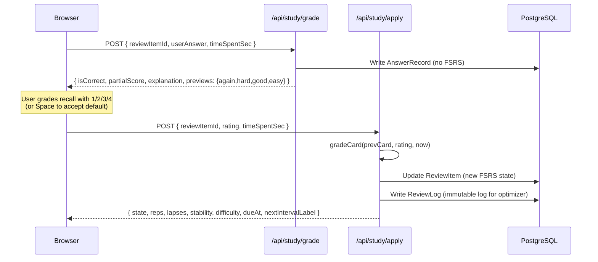

<p align="center">
  
</p>

<h1 align="center">Compass · Quiz Compass</h1>

<p align="center">
  FSRS-6アルゴリズムで駆動するセルフホストの間隔反復クイズツール、海用計器の美学を採用しています。<br/>
  Markdown / Excel / Word の問題バンクをインポート → キーボード駆動のコックピットで回答 → アルゴリズムが各カードの再出題タイミングを決定します。
</p>

<p align="center">
  <a href="README.md">English</a> &nbsp;|&nbsp;
  <a href="README.zh-CN.md">简体中文</a> &nbsp;|&nbsp;
  <strong>日本語</strong>
</p>

<p align="center">
  <a href="LICENSE"></a>
  <a href="https://github.com/weed33834/compass/actions/workflows/ci.yml"></a>
  <a href="https://gitcode.com/badhope/compass/releases"></a>
  
  
  
  
  
  
  
  
  
</p>

<p align="center">
  <a href="#compassとは">Compassとは</a> ·
  <a href="#クイックスタート">クイックスタート</a> ·
  <a href="#dockerデプロイ">Docker</a> ·
  <a href="#問題バンクのインポート">インポート</a> ·
  <a href="#二段階コミット">アーキテクチャ</a> ·
  <a href="#テスト">テスト</a> ·
  <a href="#ロードマップ">ロードマップ</a>
</p>

---

## Compassとは

クイズツールは至る所にあります。Compassは2つの異なる問題を解決するために存在します：

1. **ベンダーロックインなし。** 問題バンクはあなたのものです — エクスポートし、編集し、ツールを切り替えてください。Compassはバンクをプレーンテキストフレンドリに扱います：Markdownはノートのように読め、Excelはそのまま貼り付けられ、Word文書はドロップするだけでパースされます。データベースは完全にオープンなスキーマを持つPostgreSQLで、いつでも`pg_dump`して去ることができます。
2. **復習間隔を自分で計算するのをやめる。** AnkiのSM-2アルゴリズムは1985年のものです。間隔反復は進化しました。CompassはFSRS-6（DSRモデル、21のデフォルト重み）を実装する[ts-fsrs](https://github.com/open-spaced-repetition/ts-fsrs)を実行し、*自分がどれだけ正確に思い出したか*と*このカードがいつ戻ってくるか*を分離します — あなたは1/2/3/4を押して思い出し度を採点するだけで、残りはアルゴリズムが処理します。

海用計器の美学が存在するのは、*コンパス / 漂流ボトル / 航海日誌*が*案内 / 間違い帳 / 回答履歴*に自然にマッピングされるからです。

> **リポジトリミラー**
> - プライマリ（GitCode）: <https://gitcode.com/badhope/compass>
> - GitHubミラー: <https://github.com/weed33834/compass>
>
> 両方とも同期されています。PRとissueはどちらでも歓迎します。

---

## コア機能

| モジュール | ルート | 機能 |
|---|---|---|
| Compass | `/compass` | 今日の期限切れ数、連続日数、バンク艦隊、ワンクリック開始 |
| 学習コックピット | `/study` | 4種類の問題形式、4キーFSRS評価（ホットキー1-4）、キーごとの間隔プレビュー、選択漏れの部分点、再開機能（localStorage 7日間）、完了レポート |
| Workshop | `/workshop` | バンクCRUD、ドラッグ＆ドロップインポート（`.md/.txt/.xlsx/.csv/.docx`）、バンクごとのFSRS設定、ページネーション付き問題リスト |
| バンク詳細 | `/workshop/[id]` | ページネーション + 検索 + タイプフィルタ、**インライン問題編集**（4種類 + 難易度 + スター + 有効化 + 論理削除）、**バンクごとのFSRSチューニング**（トグル + 保持率 + 1日あたりの新規カード数 + 復習上限）、**CSV / Ankiエクスポート** |
| 漂流ボトル | `/wrongbook` | `lapses > 0`のカードがここに漂流します。展開して回答/解説を表示、習得済みまたはやり直しをマーク |
| 航海日誌 | `/logbook` | すべての回答記録を逆時系列タイムラインで、日ごとにグループ化、バンクでフィルタ可能 |
| アナリティクス | `/analytics` | 連続日数、正答率、FSRS状態分布、**365日回答ヒートマップ**、SVGトレンド、タイプごとの正答率、弱点知識ポイントTOP 10、記憶ヘルス（Retrievabilityリング + 5バケット分布 + 7日間期限予測） |
| アカウント | `/account` | プロフィール、テーマ切替（深海 / 羊皮紙）、FSRSパラメータプレビュー、サインアウト |

### 4種類の問題形式と採点ルール

| タイプ | 回答形式 | 採点 |
|---|---|---|
| `SINGLE_CHOICE` | `"B"` | 正解 = 1.0、それ以外 = 0 |
| `MULTI_CHOICE` | `["A","C"]` | 全問正解 = 1.0；選択漏れ = `0.5 + (selected-correct / expected-correct) * 0.5`、最大0.99；誤選択 = 0 |
| `TRUE_FALSE` | `true` / `false` | 正解 = 1.0、それ以外 = 0 |
| `FILL_BLANK` | `["Beijing"]` | 各空欄を独立して正規化（trim + 小文字化 + 全角→半角 + ホワイトスペース圧縮）；`\|`で許容回答を区切る |

---

## 二段階コミット

FSRSの二重スケジューリング（ユーザーがデフォルト評価を上書きした場合）を避けるため、回答フローは2つのAPI呼び出しに分割されます：



`grade`フェーズは`partialScore`からデフォルト評価を自動マッピングします（全問正解 → GOOD、部分点 → HARD、全問不正解 → AGAIN）。`Space`でデフォルトを受け入れるか、`1/2/3/4`で上書きします。

---

## クイックスタート

### 前提条件

| ツール | 最低バージョン | 備考 |
|---|---|---|
| Node.js | 22.13 | pnpm 11は`node:sqlite`に依存、Node 22+が必要 |
| pnpm | 11 | `package.json`の`packageManager`フィールドで固定；corepackが自動インストール |
| PostgreSQL | 17 | 16も動作しますが、強制しません |

### 手順

```bash
git clone https://gitcode.com/badhope/compass.git
cd compass
pnpm install
cp .env.example .env
# Edit .env, at minimum set:
#   DATABASE_URL=postgresql://postgres:<password>@localhost:5432/compass
#   NEXTAUTH_SECRET=<generate with: openssl rand -base64 32>

pnpm db:generate
pnpm db:migrate
pnpm db:seed      # Optional: 3 sample banks, 60 questions total (FSRS / China geography / TypeScript), covers all 4 types
pnpm dev          # → http://localhost:3000
```

シードにはデモアカウントが含まれます：`captain@compass.dev` / `Compass-Test-2026!`。本番環境では変更または削除してください。

---

## Dockerデプロイ

Node.js / PostgreSQLをローカルにインストールする手間を省きます — Docker Composeで3ステップで起動できます：

```bash
git clone https://gitcode.com/badhope/compass.git
cd compass
cp .env.example .env
# At minimum change:
#   NEXTAUTH_URL=http://your-domain-or-ip:3000
#   NEXTAUTH_SECRET=$(openssl rand -base64 32)
#   POSTGRES_PASSWORD=<strong password>

docker compose up -d --build
```

`http://localhost:3000`にアクセスしてください。コンテナは自動的に以下を実行します：

1. PostgreSQLヘルスチェックを待機（最大60秒）
2. `prisma migrate deploy`を実行（すべてのマイグレーションを適用）
3. Next.jsスタンドアロン本番サーバーを起動

### 含まれるもの

| コンテナ | イメージ | 目的 |
|---|---|---|
| `compass-db` | `postgres:17-alpine` | 永続ボリューム付きデータベース |
| `compass-app` | このリポジトリの`Dockerfile`からビルド | Compass本体（非rootユーザー、initとしてtini） |
| `compass-caddy`（オプション） | `caddy:2-alpine` | 自動HTTPSリバースプロキシ + セキュリティヘッダー、本番推奨 |

### 本番チェックリスト

- [ ] `NEXTAUTH_URL`を実際のアクセスドメインに設定
- [ ] `openssl rand -base64 32`で`NEXTAUTH_SECRET`を生成
- [ ] `POSTGRES_PASSWORD`に強力なパスワードを設定
- [ ] `docker-compose.yml`の`caddy`セクションをアンコメント、`DOMAIN`を設定、自動HTTPSを有効化
- [ ] リバースプロキシの背後にある場合？`TRUSTED_PROXY_IPS`をプロキシIP（カンマ区切り）に設定、さもないとレート制限が不正確になる可能性があります
- [ ] （オプション）パスワードリセットメール用に`SMTP_URL`を設定

### イメージ機能

- **マルチステージビルド**: `deps → builder → runner`；最終イメージにはスタンドアロン出力 + 必要なnode_modulesのみ、約200MB
- **非rootランタイム**: `node:22-alpine` + `node`ユーザー、最小権限
- **PID 1としてのtini**: 適切なシグナル処理 + ゾンビプロセス回収
- **HEALTHCHECK**: 組み込みの`/api/health`プローブ、K8s / Docker Swarm対応
- **docker-entrypoint.sh**: DB待機 → マイグレーション → 起動、安全なブート順序

> 手動コマンドが好みですか？`docker build -t compass .`の後`docker run -p 3000:3000 --env-file .env compass`でも動作します — PostgreSQLはご自身でご用意ください。

---

## 問題バンクのインポート

### 公式バンク（組み込み）

Compassは4つの公式バンクを`public/official-banks/`のMarkdown静的ファイルとして同梱しています：

| バンク | 問題数 | カバレッジ |
|------|-----------|----------|
| FSRS & 間隔反復入門 | 20 | FSRS-6コア概念、DSRモデル、評価メカニズム、パラメータ最適化 |
| 中国の地理と文化 | 20 | 省級地域、河川と山脈、世界遺産、二十四節気と民俗 |
| プログラミング基礎 & TypeScript | 20 | 型システム、ジェネリクス、非同期、モジュール、ベストプラクティス |
| Pythonプログラミング基礎 | 20 | データ型、制御フロー、関数、モジュール、OOP、例外 |

`/workshop`に移動 → 「公式バンク」をクリック → バンクを選択 → 「読み込み」をクリック。バンクファイルはリポジトリに同梱されており、**読み込まれるまでデータベース容量を消費しません**。読み込みにはMarkdownインポートAPIを再利用します。

### Markdown（推奨）

```markdown
# Bank name (optional, first line)

---

## Single choice

The stem can span multiple lines.

A. Option A
B. Option B
C. Option C
D. Option D

Answer: B
Explanation: Because B is correct.
Difficulty: 3
Knowledge: algebra-basics, exam-2024
Source: 2024 national exam

---

## Multiple choice

Which of the following are correct?

A. Option A
B. Option B

Answer: AC

---

## True / False

The Earth is round.

Answer: True

---

## Fill in the blank

The capital of China is ____.

Answer: Beijing
```

空欄補充は複数空欄（`||`区切り）と許容回答（`|`区切り）をサポートします：

```
Answer: Beijing|Beijing||Yangtze|Yangtze River
```

### Excel / CSV

最初の行はヘッダーです（大文字小文字を区別しない、中国語エイリアスも受け付けます）：

| 列 | 必須 | 内容 |
|---|---|---|
| `type` | はい（または自動推論） | `single` / `multi` / `true-false` / `fill-blank`（中国語も受け付け） |
| `stem` | はい | 問題文 |
| `options` | 選択タイプでは必須 | `A.Option A|B.Option B|C.Option C`（パイプ区切り） |
| `answer` | はい | 単一`"B"` / 複数`"AC"`または`"A,C"` / 真偽`"True"` / 空欄`"Beijing||Yangtze"` |
| `explanation` | オプション | Markdown |
| `difficulty` | オプション | 1-5 |
| `knowledge` | オプション | カンマ区切り |
| `source` | オプション | 自由テキスト |

### Word（.docx）

両方のスタイルが受け付けられます：

1. **Markdownスタイル** — 上記のMarkdownをWord文書に直接貼り付けます。
2. **プレーンテキストスタイル** — 空行で問題を区切ります。各ブロックはタイプラベル（`Single choice` / `True/False` / …）で始まります。オプションと回答はMarkdownと同じ形式に従います。

---

## 設定

すべての環境変数は`.env.example`に文書化されています。必須の3つ：

| 変数 | 目的 |
|---|---|
| `DATABASE_URL` | PostgreSQL接続文字列 |
| `NEXTAUTH_URL` | デプロイURL（ローカル開発では`http://localhost:3000`） |
| `NEXTAUTH_SECRET` | JWT署名キー、`openssl rand -base64 32`で生成 |

オプション: SMTP設定でパスワードリセットメールを有効化；OAuthプロバイダ（GitHub、Google）でサードパーティログインを有効化。

---

## アーキテクチャ概要

```
src/
  app/
    (main)/              認証済みページ
      compass/           ホームダッシュボード（今日の概要 + バンク艦隊）
      study/             学習コックピット（4種類 + 4キー評価）
      workshop/          Workshop（バンク管理 + インポート）
        [id]/            バンク詳細（ページネーション付き問題リスト）
      wrongbook/         漂流ボトル（間違い帳）
      logbook/           航海日誌（回答履歴）
      analytics/         アナリティクス（統計 + ヒートマップ）
      account/           アカウントセンター
    login/ register/     認証ページ
    api/                 RESTエンドポイント
      banks/             バンクCRUD + インポート
      questions/         問題CRUD
      study/             queue / grade / apply / sessions
      wrongbook/         間違いリスト + 習得済みマーク
      logbook/           回答履歴
      analytics/         統計集計
  components/
    AppShell.tsx         左ナビ + モバイル下部バー
    ui/                  Button / Card / Input / ...
  lib/
    auth.ts              NextAuth設定
    prisma.ts            Prismaシングルトン
    fsrs.ts              FSRS-6ラッパー（grade / preview / format）
    quiz/
      grading.ts         統合4タイプ採点
      scheduler.ts       日次キュービルダー（期限 + 新規 + 間違いやり直し）
      import/            Markdown / Excel / Word パーサー
prisma/
  schema.prisma          12モデル
  seed.ts                サンプルバンク
```

### データモデル

| モデル | 目的 |
|---|---|
| `User` | アカウント、テーマ、言語 |
| `QuestionBank` | バンクごとのFSRS設定付きバンク（`newCardsPerDay` / `desiredRetention`） |
| `Question` | 問題文、オプションJSON、回答JSON、解説、知識ポイント |
| `ReviewItem` | ユーザー × 問題のFSRSカード状態（stability / difficulty / reps / lapses / dueAt） |
| `ReviewLog` | FSRSオプティマイザ用の不変レビューログ |
| `AnswerRecord` | 各回答試行、部分点と所要時間を含む |
| `QuizSession` | オプションのセショングループ化 |
| `SessionAnswer` | セッション内の単一回答 |
| `FsrsParams` | ユーザーレベルのFSRS重み（オプティマイザ用） |
| `LearningPlan` | 学習計画（予約済み） |
| `AgentGenerationTask` | AIエージェントタスクキュー（V2） |
| `Notification` / `WeeklyReview` | 通知 + 週次レビュー（予約済み） |

### APIエンドポイント

- **Auth** — `/api/auth/[...nextauth]`, `/api/auth/register`, `/api/auth/forgot-password`, `/api/auth/reset-password`
- **Banks** — `/api/banks` (GET/POST), `/api/banks/:id` (GET/PATCH/DELETE), `/api/banks/:id/questions` (GET/POST), `/api/banks/import` (POST multipart)
- **Questions** — `/api/questions/:id` (GET/PATCH/DELETE)
- **Study** — `/api/study/queue`, `/api/study/grade`, `/api/study/apply`, `/api/study/sessions`
- **Wrong book** — `/api/wrongbook` (GET/PATCH)
- **Logbook** — `/api/logbook` (GET)
- **Analytics** — `/api/analytics` (GET)
- **Health** — `/api/health` (GET) → Docker / K8s プローブ

---

## テスト

Compassは3つのテストレイヤーを維持しています。CIはpush / PRごとに最初の2つを実行します：

### ユニットテスト（DB不要、CI必須）

`pnpm test:unit`は3つのコアモジュールにわたる49の純粋ロジックテストを実行します：

| テストファイル | 件数 | カバレッジ |
|---|---|---|
| `scripts/grading-test.ts` | 13 | 4タイプ採点：単一 / 複数（選択漏れの部分点）/ 真偽（中国語+英語ブール値）/ 空欄補充（複数空欄 + `\|` 許容回答 + 正規化） |
| `scripts/fsrs-test.ts` | 19 | Prisma文字列enum ↔ ts-fsrs数値Stateの双方向変換、`dbRowToCard` / `cardToDbUpdate`、`gradeCard`スケジューリング、`previewIntervals`、`formatInterval`、`scoreToRating`マッピング |
| `scripts/parser-test.ts` | 17 | Markdown / Excel / Word パーサー：有効なパース、空/バイナリ/未知の拡張子の拒否、回答欠落警告、回答がオプションにない警告、ナンバリングフォーマット互換性 |

テストはテストフレームワーク依存なしで`node:assert`を使用；`tsx`が直接実行します。

### APIスモークテスト（開発サーバー + DBが必要）

`pnpm test:api`は`scripts/api-test.ts`を実行し、未認証のインターセプト、NextAuthログイン、バンクCRUD、二段階コミット、漂流ボトル、航海日誌、アナリティクスをカバー — 7グループ。先に`pnpm dev` + 準備完了のデータベースが必要です。

### E2Eテスト（Playwright、開発サーバー + DBが必要）

`tests/e2e/`配下の4つのPlaywrightスイートが実際のユーザークリックをシミュレートします：

| ファイル | ケース | カバレッジ |
|---|---|---|
| `visual-walkthrough.spec.ts` | 15 | サイト全体のビジュアルウォークスルー：ランディング / ログイン / 登録 / compass / workshop / study / wrongbook / logbook / analytics / account / 404 |
| `import-flow.spec.ts` | 7 | バンクインポート：有効なMarkdown / CSV / Word、空/バイナリ/未知の拡張子の拒否、警告プロンプト |
| `answering-flow.spec.ts` | 5 | 完全な回答フロー：開始 / 全問回答 / 完了レポート / 再生 / 間違いやり直し |
| `full-flow.spec.ts` | — | エンドツーエンドの完全フローチェーン |

E2Eの実行：`pnpm exec playwright test`（先に`playwright.config.ts`のbaseURLを設定してください）。

### CI戦略

CI（`.github/workflows/ci.yml`）は自動化を最小限に保ちます — 自動公開 / デプロイ / 依存関係更新 / 自動マージ / ボットコメントは**ありません**：

- `main`への`push` / `PR` → `install → db:generate → typecheck → lint → test:unit → build`
- `main`への`push` → 追加で`docker-build`ジョブを実行しDockerfileのビルドを検証
- Dependabotは明示的に無効化（`.github/dependabot.yml` `updates: []`）；依存関係はメンテナが手動でレビュー
- 同じブランチの新しいコミットは古い実行をキャンセルし、CI枠を節約

---

## 技術スタック

| レイヤー | 選択 | バージョン |
|---|---|---|
| フレームワーク | Next.js (App Router) | 16.2.11 |
| 言語 | TypeScript | 5.9 |
| スタイリング | Tailwind CSS | 4.3.3 |
| ORM | Prisma | 5.22 |
| データベース | PostgreSQL | 17 |
| 認証 | NextAuth.js | 4.24.15 |
| 間隔反復 | ts-fsrs | 5.4 |
| UIプリミティブ | Radix UI | 1.1.21 |
| Excelパース | xlsx | 0.18 |
| Wordパース | mammoth | 1.12 |
| アニメーション | framer-motion | 12.42 |
| アイコン | Lucide React | 1.25 |
| バリデーション | Zod | 4.4 |
| ランタイム | Node.js | ≥22.13 |

---

## デザインシステム

インターフェースは航海と天文学の言葉を借りています — 真鍮のリング、深淵の背景、アイボリーのテキスト、コーラルのアラート。

**コアパレット**

| トークン | Hex | 用途 |
|---|---|---|
| `abyss` | `#0a0f14` | 背景の深み |
| `ivory` | `#f0ead6` | プライマリテキスト |
| `brass` | `#c89b3c` | インタラクティブハイライト、ナビゲーション |
| `coral` | `#e0584a` | 破壊的アクション、期限アラート |

**フィードバックパレット**（4キー評価バー + 回答表示）

| トークン | Hex | 意味 |
|---|---|---|
| `f-emerald` | `#10b981` | EASY — 流暢な思い出し |
| `f-azure` | `#38bdf8` | GOOD — 通常の思い出し |
| `f-amber` | `#f59e0b` | HARD — ぎりぎり正解 |
| `f-coral2` | `#ef4444` | AGAIN — 完全な失念 |

2つのテーマ：
- **深海**（デフォルト） — 深淵の背景 + 真鍮のハイライト + 星空
- **羊皮紙** — 温かいクリーム色の背景 + 暗褐色のテキスト + 真鍮は維持

フォントはシステムネイティブファミリーのみを使用 — 見出しにGeorgiaセリフ、本文にsystem-ui、データにui-monospace。外部CDNフォントはありません。

---

## コマンドリファレンス

| コマンド | 目的 |
|---|---|
| `pnpm dev` | 開発サーバー（ポート3000） |
| `pnpm build` | 本番ビルド |
| `pnpm start` | 本番サーバー起動 |
| `pnpm lint` | ESLint |
| `pnpm typecheck` | TypeScript型チェック（`tsc --noEmit`） |
| `pnpm test:unit` | ユニットテスト（採点 + FSRS + パーサー、DB不要） |
| `pnpm test:grading` | 採点ユニットテストのみ実行 |
| `pnpm test:fsrs` | FSRS状態マッピングユニットテストのみ実行 |
| `pnpm test:parser` | インポートパーサーユニットテストのみ実行 |
| `pnpm test:api` | APIスモークテスト（`pnpm dev` + DBが必要） |
| `pnpm db:generate` | Prismaクライアント生成 |
| `pnpm db:migrate` | データベースマイグレーション実行（開発） |
| `pnpm db:deploy` | マイグレーションデプロイ（本番） |
| `pnpm db:seed` | サンプルバンク挿入 |
| `pnpm db:studio` | Prisma Studio GUI起動 |

---

## ロードマップ

### V1 — クイズ基盤（完了）

- [x] FSRS-6スケジューリング + 4キー評価バー
- [x] 統一採点付き4種類の問題形式 + 選択漏れの部分点
- [x] Markdown / Excel / Wordインポート
- [x] 漂流ボトル（間違い帳）+ 航海日誌 + アナリティクス
- [x] 深海 / 羊皮紙デュアルテーマ

### V1.1 — ポリッシュ（完了）

- [x] 初回訪問ウェルカムガイドカード（localStorageフラグ、閉じる可能）+ アップグレードされたバンク艦隊カード（説明 / タグ / プログレスバー）
- [x] 完了レポートを学習プロフィールにアップグレード：プロフィールタグ + タイプごとの習得度 + FSRS評価分布 + 弱点知識TOP 3 + 選択漏れヒント + 実行可能なアドバイス
- [x] シードバンク拡張：12 → 60問（FSRS概念 / 中国地理 / TypeScript）
- [x] 間違い帳ロジック修正：AGAIN評価もボトルに入る（以前はFSRSのlapsesのみが入っていた；NEW/LEARNINGカードで間違えたものが漏れていた）
- [x] ナビブランドエリアにロゴ埋め込み、モバイルトップバーに同期

### V1.2 — 記憶ヘルス & 再開（完了）

- [x] **記憶ヘルス（Retrievability）**: アナリティクスにFSRS-6減衰曲線可視化を追加 — 平均保持率リング + 5バケット分布（critical / fragile / fair / stable / fresh）+ 忘却アラート（R<70%）+ 7日間期限予測バーチャート
- [x] **退出後の再開**: 学習中に退出して`/study`に戻るとlocalStorageセーブを検出し「継続 / 破棄」をプロンプト；セーブは7日後に期限切れ、ラウンド完了時にクリア
- [x] **オープンソース整備**: CIワークフロー（typecheck + lint + buildゲート）+ Dependabotを明示的に無効化 + PRテンプレートにメンテナの自動化ポリシーを文書化

### V1.3 — Workshop & アナリティクス拡張（完了）

- [x] **インライン問題編集**: 4種類 + 難易度 + スター + 有効化 + 論理削除、削除確認付き
- [x] **バンクごとのFSRSチューニング**: トグル / 保持率スライダー / 1日あたりの新規カード数 / 復習上限
- [x] **CSV / Ankiエクスポート**: CSVはインポート互換（BOM付き）、Anki TSVは`#deck` / `#tags`列ヘッダー付き
- [x] **アナリティクス365日ヒートマップ**: GitHubスタイルの4色スケール、月/週ラベル、ツールチップ

### V1.4 — 公式バンクオンデマンド（完了）

- [x] **組み込み公式バンク**: 4バンク（FSRS / 中国地理 / TypeScript / Python）を`manifest.json`インデックス付きのMarkdown静的ファイルとして同梱
- [x] **オンデマンド読み込みUI**: `/workshop` →「公式バンク」ダイアログ → クリックして読み込み；読み込まれるまでデータベースフットプリントなし
- [x] **スリム化されたシード**: バンクを自動挿入しなくなり、デモユーザー + FSRSパラメータのみ作成

### V1.4.1 — 本番の堅牢化（完了）

- [x] **Dockerワンクリックデプロイ**: マルチステージDockerfile + docker-compose（app + db + オプションcaddy）+ docker-entrypoint.sh + `/api/health`プローブ
- [x] **3つのクリティカル修正**: FSRS Stateの文字列/数値型不一致によるスケジューリング破壊、バンク削除時のFKカスケード欠落、applyのべき等性なし
- [x] **6つのHigh修正**: アナリティクスN+1クエリ（365 → 1）、漂流ボトルerrorReason永続化、IP信頼チェーンセキュリティ、採点二重カウント、timeSpentSecクランプ、パスワード忘れステータスコード
- [x] **49のユニットテスト**: 採点13 + FSRS状態マッピング19 + パーサー17、CI必須
- [x] **CI堅牢化**: 新しい`test:unit`ステップ + Dockerfileビルドを検証する`docker-build`ジョブ

### V2 — AIエージェント

- [ ] 資料アップロード → エージェントが問題バンクを自動生成
- [ ] 知識ポイントの自動タグ付け
- [ ] 回答データからの難易度自動キャリブレーション
- [ ] レビューログに基づく個人FSRS重みオプティマイザ

### V3 — マルチプラットフォーム

- [ ] WeChatミニプログラム（API + デザイントークン共有）
- [ ] モバイルPWAチューニング
- [ ] 公開バンク共有（読み取り専用リンク）

---

## コントリビュート

issueとPRを歓迎します。PRを開く前に、[CONTRIBUTING.md](CONTRIBUTING.md)をお読みください — コードスタイル、コミット規約、クイズロジックルーティングルール（すべての採点は`src/lib/quiz/grading.ts`を経由、すべてのFSRSスケジューリングは`src/lib/fsrs.ts`を経由；ルートハンドラから直接`ts-fsrs`を呼び出さないでください）をカバーしています。

行動規範については[CODE_OF_CONDUCT.md](CODE_OF_CONDUCT.md)を参照してください。セキュリティ問題については、[SECURITY.md](SECURITY.md)を参照してください — 公開のissueを開かないでください；非公開の開示プロセスに従ってください。

---

## ライセンス

MIT — [LICENSE](LICENSE)を参照してください。
