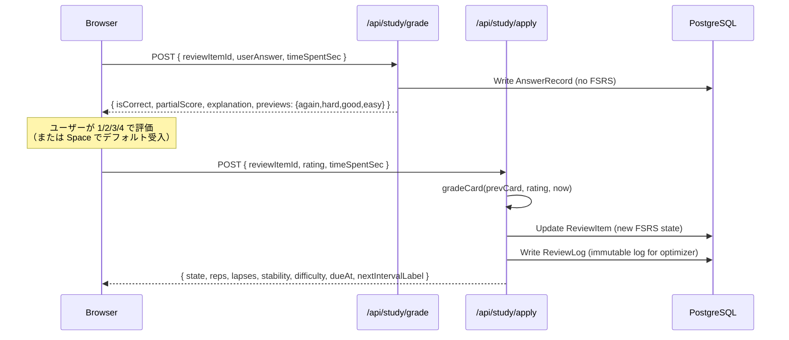
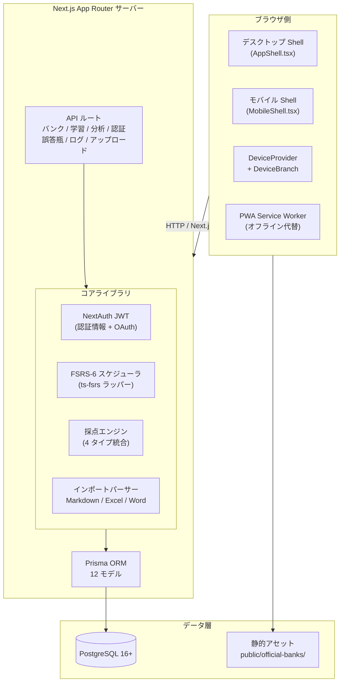
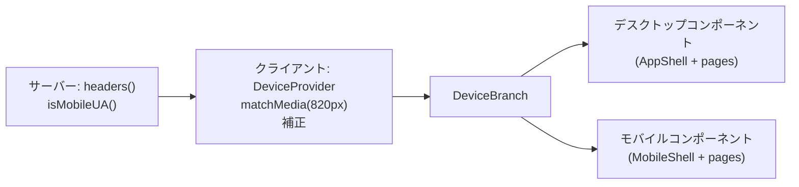

<p align="center">
  
</p>

<h1 align="center">Compass · 学習羅針盤</h1>

[English](README.md) | [中文](README.zh.md) | [日本語](README.ja.md)

<p align="center">
  FSRS-6 アルゴリズムで駆動するセルフホストの間隔反復クイズツール。航海計器をモチーフにしたデザイン。<br/>
  Markdown / Excel / Word の問題バンクをインポート → キーボード駆動のコックピットで回答 → アルゴリズムが復習のタイミングを決定。
</p>

<p align="center">
  <a href="LICENSE"></a>
  <a href="#"></a>
  <a href="https://gitcode.com/badhope/compass/releases"></a>
  
  
  
  
  
  
  
  
  
</p>

<p align="center">
  <a href="#これは何か">これは何か</a> ·
  <a href="#学習ガイド">学習ガイド</a> ·
  <a href="#コア機能">機能</a> ·
  <a href="#デバイス対応モバイル適応">モバイル</a> ·
  <a href="#クイックスタート">クイックスタート</a> ·
  <a href="#デプロイ">デプロイ</a> ·
  <a href="#アーキテクチャ概要">アーキテクチャ</a> ·
  <a href="#テスト">テスト</a> ·
  <a href="#ロードマップ">ロードマップ</a>
</p>

---

## これは何か

学習羅針盤（Compass）は、セルフホスト型のオープンソースクイズツールで、プロプライエタリなクイズアプリの代替として設計されています。2 つの問題を解決します：

1. **ベンダーロックインなし。** 問題バンクはあなたのものです。Markdown（ノートのように読みやすい）、Excel（そのまま貼り付け）、Word（ドラッグ＆ドロップ）でインポート。いつでもエクスポート可能。PostgreSQL と完全にオープンなスキーマで、`pg_dump` して自由に持ち出せます。

2. **復習間隔を自分で計算する必要なし。** Anki の SM-2 は 1985 年の技術。間隔反復はその後進化しています。Compass は [ts-fsrs](https://github.com/open-spaced-repetition/ts-fsrs) を使用して **FSRS-6**（DSR モデル、21 のデフォルト重み）を実装。「どれだけ正確に思い出せたか」と「カードがいつ戻ってくるか」を分離——1-4 で評価するだけで、アルゴリズムがスケジュールを処理します。

航海をテーマにした命名——学習羅針盤（導き）、誤答漂流瓶（間違い帳）、航海日誌（回答履歴）、航海計画（学習計画）——はアプリの機能に自然に対応しています。

> **リポジトリ**：<https://gitcode.com/badhope/compass>

---

## 学習ガイド

### 学習羅針盤の 5 ステップ使い方

1. **サインアップ**——`/register` にアクセスしてアカウントを作成。（デモ：`captain@compass.dev` / `Compass-Test-2026!`）
2. **問題バンクをインポート**——`/workshop`（問題工房）に移動、「公式バンク」を開き、FSRS / 地理 / TypeScript / Python から選んで「読み込み」をクリック。または `.md` / `.xlsx` / `.docx` ファイルをページにドラッグ。
3. **学習を開始**——学習羅針盤のダッシュボード（`/compass`）で「開始」ボタンをクリック。アルゴリズムが期限切れのカードをキューに取り込みます。
4. **回答と評価**——答えを入力し、`Enter` で送信。4 キードック（またはキーボード 1-4）で思い出し度を評価：
   - `1` **Again** — 完全忘却、カードリセット
   - `2` **Hard** — かろうじて思い出した、短い間隔
   - `3` **Good**（デフォルト）— 正常な想起、通常の間隔
   - `4` **Easy** — 流暢、長い間隔
5. **復習と分析**——誤答漂流瓶（`/wrongbook`）で蓄積した間違いを確認、または分析（`/analytics`）で記憶の健康度、連続日数、ヒートマップ、FSRS 状態分布を表示。

> 💡 アプリはデバイスに応じて**デスクトップとモバイルレイアウトを自動切替**します。モバイルでは下部ナビゲーションバーとスワイプ操作を使用します。

---

## コア機能

| モジュール | ルート | 機能 |
|---|---|---|
| **学習羅針盤**（ダッシュボード） | `/compass` | 今日の期限切れ数、連続日数、バンク艦隊、ワンクリック開始 |
| **学習コックピット** | `/study` | 4 题型、4 キー FSRS 評価（ホットキー 1-4）、間隔プレビュー、部分点、再開機能、完了レポート |
| **問題工房** | `/workshop` | バンク CRUD、ドラッグ＆ドロップインポート（`.md/.txt/.xlsx/.csv/.docx`）、公式バンクオンデマンド、バンクごとの FSRS 設定 |
| **バンク詳細** | `/workshop/[id]` | インライン問題編集、CSV/Anki エクスポート、FSRS チューニング（保持率/新規カード数/復習上限） |
| **誤答漂流瓶** | `/wrongbook` | 誤答が 1 回以上のカード；復習、習得済みマーク、再回答が可能 |
| **航海日誌** | `/logbook` | 全回答記録を逆時系列で表示、バンクでフィルタ可能 |
| **分析** | `/analytics` | 連続日数、正答率、FSRS 状態分布、365 日ヒートマップ、記憶健康度（検索可能リング + 5 バケット分布 + 7 日予測）、弱点知識 TOP 10 |
| **アカウント** | `/account` | プロフィール、デュアルテーマ切替（深海/羊皮紙）、FSRS パラメータプレビュー、言語切替 |

### 4 つの問題タイプと採点ルール

| タイプ | 回答形式 | 採点 |
|---|---|---|
| `SINGLE_CHOICE` | `"B"` | 正解 = 1.0、それ以外 = 0 |
| `MULTI_CHOICE` | `["A","C"]` | 全正解 = 1.0；選択漏れ = `0.5 + (選択正解数/期待正解数) * 0.5`、上限 0.99；誤選択 = 0 |
| `TRUE_FALSE` | `true` / `false` | 正解 = 1.0、それ以外 = 0 |
| `FILL_BLANK` | `["北京"]` | 各空欄を正規化（trim + 小文字 + 全角→半角 + 空白圧縮）；`|` で許容回答を区切る |

---

## デバイス対応モバイル適応

Compass は **DeviceBranch** パターンを採用——同じ URL でデスクトップとモバイルに**完全に独立したコンポーネントツリー**をレンダリング。CSS のレスポンシブ縮小ではありません。

```
サーバー側 UA 検出 → isMobileUA()
         ↓
ブラウザ matchMedia (820px) 補正
         ↓
    DeviceProvider (React コンテキスト)
         ↓
    DeviceBranch({mobile, desktop})
```

- **デスクトップ**：`AppShell`——左サイドバーナビ、ワイドレイアウト、キーボード中心の操作。
- **モバイル**：`MobileShell`——下部 4 タブナビ + FAB、タッチ最適化カードレイアウト、スワイプ進行、`safe-area-inset` 対応。

全 12 ルート（`login`, `register`, `compass`, `study`, `workshop`, `wrongbook`, `logbook`, `analytics`, `account`, `forgot-password`, `reset-password`, `bank-detail`）に独立したモバイルページがあります。

---

## 二段階コミット

FSRS の二重スケジューリング（ユーザーがデフォルト評価を上書きした場合）を回避するため、回答フローは 2 つの API 呼び出しに分割されています：


```mermaid
sequenceDiagram
    participant U as Browser
    participant G as /api/study/grade
    participant A as /api/study/apply
    participant DB as PostgreSQL

    U->>G: POST { reviewItemId, userAnswer, timeSpentSec }
    G->>DB: Write AnswerRecord (no FSRS)
    G-->>U: { isCorrect, partialScore, explanation, previews: {again,hard,good,easy} }

    Note over U: ユーザーが 1/2/3/4 で評価<br/>（または Space でデフォルト受入）

    U->>A: POST { reviewItemId, rating, timeSpentSec }
    A->>A: gradeCard(prevCard, rating, now)
    A->>DB: Update ReviewItem (new FSRS state)
    A->>DB: Write ReviewLog (immutable log for optimizer)
    A-->>U: { state, reps, lapses, stability, difficulty, dueAt, nextIntervalLabel }
```

`grade` フェーズでは `partialScore` からデフォルト評価を自動マッピング（全正解 → GOOD、部分 → HARD、全誤 → AGAIN）。`Space` でデフォルト受入、`1/2/3/4` で上書き。

---

## クイックスタート

### 前提条件

| ツール | 最小バージョン | 備考 |
|---|---|---|
| Node.js | 22.13 | pnpm 11 が必要 |
| pnpm | 11 | `package.json` の `packageManager` で固定；corepack が自動インストール |
| PostgreSQL | 16+ | 17 も可 |

### ローカル開発

```bash
git clone https://gitcode.com/badhope/compass.git
cd compass
pnpm install
cp .env.example .env
# .env を編集——最低限以下を設定：
#   DATABASE_URL      postgresql://postgres:<パスワード>@localhost:5432/compass?schema=public
#   NEXTAUTH_SECRET   openssl rand -base64 32

pnpm db:generate
pnpm db:migrate
pnpm db:seed          # デモユーザー + FSRS パラメータを作成（バンクなし）
pnpm dev              # → http://localhost:3000
```

シードはデモアカウントを作成：`captain@compass.dev` / `Compass-Test-2026!`。本番環境では変更または削除してください。

### 公式バンクのインポート

```bash
pnpm exec tsx scripts/import-official-banks.mjs
```

デモユーザーとしてログインし、4 つの公式バンク（FSRS 入門、中国地理、TypeScript、Python）を問題工房にインポート——合計 80 問、すぐに学習可能。

---

## デプロイ

### Docker（セルフホスト、推奨）

リポジトリに `Dockerfile` + `docker-compose.yml` が同梱されています：

```bash
cp .env.example .env
# .env を編集——DATABASE_URL は 'db' サービスを使用（下記参照）
docker compose up -d --build
docker compose run --rm app pnpm prisma migrate deploy
docker compose exec app node scripts/import-official-banks.mjs
```

> `docker-compose.yml` では、アプリは内部 Docker ネットワーク経由で `db` サービスに接続：\
> `DATABASE_URL=postgresql://compass:change-me@db:5432/compass?schema=public`

本番環境向けのリバースプロキシ + 自動 TLS（Let's Encrypt）用に `Caddyfile` サンプルを提供しています。

### クラウドプラットフォーム

詳細な手順は [DEPLOYMENT.md](DEPLOYMENT.md) を参照：

| 方法 | 最適な用途 | データベース |
|---|---|---|
| **Vercel + Neon** | 迅速な起動、サーバーレス | Neon（サーバーレス Postgres） |
| **Railway / Render** | 管理 DB 付きオールインワン | 内蔵 Postgres |
| **セルフホスト VPS + Docker** | 完全制御、プライバシー重視 | 自身の PostgreSQL |

> ⚠️ **既知の制限**：`POST /api/upload` エンドポイントはメディアファイル（問題文の画像/音声）を `public/uploads/` に書き込みます。サーバーレスプラットフォーム（Vercel）ではこのストレージは一時的——コールドスタート時にアップロードファイルは失われます。完全なファイルアップロードをサポートするには、Docker で永続ボリュームを使用するか、アップロードハンドラを S3/R2 ストレージに置き換えてください。

---

## 問題バンクのインポート

### 公式バンク（内蔵）

Compass には 4 つの公式バンクが `public/official-banks/` の Markdown 静的ファイルとして同梱されています。問題工房ページ（「公式バンク」ダイアログ）または上記のインポートスクリプトから読み込めます——読み込むまでデータベースに影響しません。

| バンク | 問題数 | 範囲 |
|---|---|---|
| FSRS と間隔反復 | 20 | DSR モデル、評価メカニズム、重み調整 |
| 中国地理と文化 | 20 | 省、河川、文化遺産、民俗 |
| プログラミング基礎と TypeScript | 20 | 型システム、ジェネリクス、非同期、モジュール |
| Python プログラミング | 20 | データ型、OOP、例外、標準ライブラリ |

### Markdown 形式（推奨）

```markdown
# バンク名（オプション、最初の行）

---

## Single choice

問題文は複数行にまたがれます。

A. オプション A
B. オプション B
C. オプション C
D. オプション D

Answer: B
Explanation: B が正解だからです。
Difficulty: 3
Knowledge: 代数基礎
Source: 2024 試験

---

## Multiple choice

次のうち正しいものはどれですか？

A. オプション A
B. オプション B

Answer: AC
```

空欄補充は複数空欄（`||` 区切り）と許容回答（`|` 区切り）をサポート：

```
Answer: Beijing|北京||Yangtze|長江
```

### Excel / CSV / Word

既存のインポートドキュメントを参照——すべての形式で中国語列エイリアス、自動タイプ推論、パイプ区切りオプションをサポートしています。

---

## 設定

すべての環境変数は `.env.example` に文書化されています。必須項目：

| 変数 | 目的 |
|---|---|
| `DATABASE_URL` | PostgreSQL 接続文字列（Prisma 形式） |
| `NEXTAUTH_URL` | デプロイ URL（本番環境では `https://` 必須） |
| `NEXTAUTH_SECRET` | JWT 署名キー——`openssl rand -base64 32` |
| `NEXT_PUBLIC_SITE_URL` | SEO metadataBase / canonical / sitemap 用公開 URL |

オプション：パスワードリセットメール用 SMTP、サードパーティログイン用 OAuth プロバイダー（GitHub/Google）、AI 出題用 OpenAI。

---

## アーキテクチャ概要


```mermaid
graph TB
    subgraph Client["ブラウザ側"]
        DS["デスクトップ Shell<br/>(AppShell.tsx)"]
        MS["モバイル Shell<br/>(MobileShell.tsx)"]
        DP["DeviceProvider<br/>+ DeviceBranch"]
        PW["PWA Service Worker<br/>(オフライン代替)"]
    end

    subgraph Server["Next.js App Router サーバー"]
        direction TB
        API["API ルート<br/>バンク / 学習 / 分析 / 認証<br/>誤答瓶 / ログ / アップロード"]
        
        subgraph Lib["コアライブラリ"]
            NA["NextAuth JWT<br/>(認証情報 + OAuth)"]
            Fs["FSRS-6 スケジューラ<br/>(ts-fsrs ラッパー)"]
            PG["採点エンジン<br/>(4 タイプ統合)"]
            Pars["インポートパーサー<br/>Markdown / Excel / Word"]
        end

        ORM["Prisma ORM<br/>12 モデル"]
    end

    subgraph Storage["データ層"]
        DB[("PostgreSQL 16+")]
        ST["静的アセット<br/>public/official-banks/"]
    end

    Client -- "HTTP / Next.js Router" --> Server
    API --> Lib
    Lib --> ORM
    ORM --> DB
    Client --> ST
```

### デバイス検出フロー


```mermaid
flowchart LR
    SR["サーバー: headers()<br/>isMobileUA()"] --> CP["クライアント: DeviceProvider<br/>matchMedia(820px)<br/>補正"]
    CP --> DB["DeviceBranch"]
    DB --> DT["デスクトップコンポーネント<br/>(AppShell + pages)"]
    DB --> MB["モバイルコンポーネント<br/>(MobileShell + pages)"]
```

### データモデル

| モデル | 目的 |
|---|---|
| `User` | アカウント、テーマ、言語、FSRS 重み |
| `QuestionBank` | バンク、バンクごとの FSRS 設定（1 日あたり新規カード数、保持率） |
| `Question` | 問題文、オプション（JSON）、回答（JSON）、解説、知識ポイント |
| `ReviewItem` | ユーザー × 問題の FSRS カード状態（安定性、難易度、期限） |
| `ReviewLog` | FSRS オプティマイザ用の不変復習ログ |
| `AnswerRecord` | 各回答試行、部分点と所要時間を含む |
| `QuizSession` / `SessionAnswer` | セッショングループ化（オプション） |
| `FsrsParams` | ユーザー FSRS 重み |
| `AgentGenerationTask` | AI エージェントタスクキュー |

### API エンドポイント

| エンドポイント | メソッド | 目的 |
|---|---|---|
| `/api/auth/[...nextauth]` | * | NextAuth：ログイン、セッション、JWT |
| `/api/auth/register` | POST | メール登録 |
| `/api/auth/forgot-password` | POST | パスワードリセットメール送信 |
| `/api/auth/reset-password` | POST | パスワードリセット |
| `/api/banks` | GET/POST | バンク一覧/作成 |
| `/api/banks/:id` | GET/PATCH/DELETE | バンク CRUD |
| `/api/banks/:id/questions` | GET/POST | 問題一覧/作成 |
| `/api/banks/import` | POST | マルチパートインポート（MD/XLSX/DOCX） |
| `/api/banks/:id/export` | GET | CSV/Anki エクスポート |
| `/api/questions/:id` | GET/PATCH/DELETE | 問題 CRUD |
| `/api/study/queue` | GET | 日次キューの構築 |
| `/api/study/grade` | POST | 採点（フェーズ 1） |
| `/api/study/apply` | POST | FSRS 評価の適用（フェーズ 2） |
| `/api/wrongbook` | GET/PATCH | 誤答リスト/習得済みマーク |
| `/api/logbook` | GET | 全回答記録 |
| `/api/analytics` | GET | 集計統計と FSRS 状態 |
| `/api/upload` | POST | メディアアップロード（画像/音声） |
| `/api/health` | GET | コンテナ健全性プローブ |
| `/robots.txt` | GET | SEO robots（環境変数駆動） |
| `/sitemap.xml` | GET | SEO sitemap（環境変数駆動） |

---

## テスト

Compass は 3 つのテストレイヤーを維持しています：

### 1. ユニットテスト（DB 不要、CI 必須）

```bash
pnpm test:unit
```

49 の純粋ロジックテスト（採点 13、FSRS 状態マッピング 19、パーサー 17）。`node:assert` 使用、テストフレームワーク依存なし。

### 2. API スモークテスト（開発サーバー + DB が必要）

```bash
pnpm test:api
```

7 テストグループ（未認証インターセプト、ログイン、バンク CRUD、二段階コミット、誤答瓶、ログ、分析）。

### 3. E2E テスト（Playwright、開発サーバー + DB が必要）

```bash
pnpm exec playwright test
```

14 のモバイル E2E テスト（`tests/e2e/`）：

| ファイル | ケース数 | 範囲 |
|---|---|---|
| `mobile-auth.spec.ts` | 3 | ログイン、登録、パスワード忘れ（モバイル Shell） |
| `mobile-navigation.spec.ts` | 7 | 全モバイルページ表示、ナビ永続化、ログアウト |
| `mobile-study.spec.ts` | 2 | 回答 + 評価サイクル、空状態 |

モバイルテストは直列実行（共有ログインセッション）でレート制限を回避。デスクトップ E2E スイートはサイトウォークスルー、インポートフロー、回答をカバー。

---

## 技術スタック

| レイヤー | 選択 | バージョン |
|---|---|---|
| フレームワーク | Next.js (App Router) | 16.2 |
| 言語 | TypeScript | 5.9 |
| スタイリング | Tailwind CSS | 4.3 |
| ORM | Prisma | 5.22 |
| データベース | PostgreSQL | 16+ |
| 認証 | NextAuth.js (JWT) | 4.24 |
| 間隔反復 | ts-fsrs | 5.4 |
| UI プリミティブ | Radix UI | 1.1 |
| Excel 解析 | xlsx | 0.18 |
| Word 解析 | mammoth | 1.12 |
| アニメーション | framer-motion | 12.42 |
| アイコン | Lucide React | 1.25 |
| バリデーション | Zod | 4.4 |
| テスト | Playwright | 1.61 |

---

## デザインシステム

航海/天文パレット——真鍮リング、深淵の奥行き、アイボリーのテキスト、コーラルのアラート。

**コアトークン**

| トークン | Hex | 用途 |
|---|---|---|
| `abyss` | `#0b1426` | 背景の深み |
| `ivory` | `#f5f1e8` | プライマリテキスト |
| `brass` | `#c9a227` | インタラクティブハイライト |
| `tide` | `#4a7c82` | セカンダリ、情報 |
| `coral` | `#d97757` | 破壊的操作 |

**フィードバックパレット**（4 キー評価）

| トークン | Hex | 評価 |
|---|---|---|
| `f-emerald` | `#10b981` | Easy — 流暢な想起 |
| `f-azure` | `#38bdf8` | Good — 通常の想起 |
| `f-amber` | `#f59e0b` | Hard — かろうじて正解 |
| `f-coral2` | `#ef4444` | Again — 完全忘却 |

2 つのテーマ：**深海**（深淵 + 真鍮 + 星空、デフォルト）と**羊皮紙**（暖かいクリーム + 濃い茶色のテキスト）。フォントはシステムネイティブ。CDN 依存なし。

---

## コマンドリファレンス

| コマンド | 目的 |
|---|---|
| `pnpm dev` | 開発サーバー（ポート 3000） |
| `pnpm build` | プロダクションビルド（standalone 出力） |
| `pnpm start` | プロダクションサーバー起動 |
| `pnpm lint` | ESLint |
| `pnpm typecheck` | TypeScript 型チェック（`tsc --noEmit`） |
| `pnpm test:unit` | ユニットテスト（採点 + FSRS + パーサー、DB 不要） |
| `pnpm test:api` | API スモークテスト（開発サーバー + DB が必要） |
| `pnpm exec playwright test` | Playwright E2E テスト |
| `pnpm db:generate` | Prisma クライアント生成 |
| `pnpm db:migrate` | マイグレーション適用（開発） |
| `pnpm db:deploy` | マイグレーションデプロイ（本番） |
| `pnpm db:seed` | デモユーザー + FSRS パラメータ挿入 |
| `pnpm db:studio` | Prisma Studio GUI 起動 |
| `node scripts/import-official-banks.mjs` | 全公式バンクインポート |

---

## ロードマップ

### V1 — クイズ基盤（完了）
- [x] FSRS-6 スケジューリング + 4 キー評価
- [x] 4 つの問題タイプと統一採点
- [x] Markdown / Excel / Word インポート
- [x] 誤答漂流瓶 + 航海日誌 + 分析
- [x] 深海 / 羊皮紙 デュアルテーマ

### V1.1–V1.4 — 洗練と強化（完了）
- [x] ウェルカムガイド、バンク艦隊カード、完了レポートアップグレード
- [x] 記憶健康度（検索可能性）+ 再開機能 + 365 日ヒートマップ
- [x] インライン問題編集 + バンクごとの FSRS チューニング + CSV/Anki エクスポート
- [x] 公式バンクオンデマンド + シードのスリム化
- [x] Docker ワンクリックデプロイ + CI + 49 ユニットテスト

### V1.5 — モバイル適応とランディングページ（完了）
- [x] **デバイス認識レンダリング**：12 ルートに独立モバイルコンポーネントツリー、DeviceBranch パターン
- [x] **モバイル Shell**：下部 4 タブナビ、FAB、タッチ最適化レイアウト、safe-area 適応
- [x] **モバイル学習**：回答 + スワイプ + 評価ドック、完全な学習フロー
- [x] **モバイル認証**：ログイン/登録/パスワード忘れ/リセットにモバイル Shell
- [x] **ランディングページ充実**：仕組み、料金プラン、FAQ アコーディオン、プライバシー/セルフホストセクション
- [x] **14 のモバイル E2E テスト**（Playwright、直列実行）
- [x] 4 つの公式バンク（80 問完全インポート）
- [x] SEO：環境変数駆動の metadataBase、sitemap、robots.txt

### V2 — AI エージェント
- [ ] 資料アップロード → 問題自動生成
- [ ] 知識ポイントの自動タグ付け
- [ ] 回答データからの難易度自動調整
- [ ] 個人 FSRS 重み最適化

### V3 — マルチプラットフォーム
- [ ] WeChat ミニプログラム（共有 API + デザイントークン）
- [ ] 公開バンク共有（読み取り専用リンク）
- [ ] Monero / Stripe サブスクリプション（価格 UI は準備済み）

---

## コントリビュート

Issue と PR は [gitcode.com/badhope/compass](https://gitcode.com/badhope/compass) で歓迎します。コードスタイル、コミット規約、クイズロジックルーティングルールについては [CONTRIBUTING.md](CONTRIBUTING.md) を参照してください。

行動規範は [CODE_OF_CONDUCT.md](CODE_OF_CONDUCT.md) を、セキュリティ問題の非公開報告は [SECURITY.md](SECURITY.md) を参照してください。

---

## ライセンス

MIT — [LICENSE](LICENSE) を参照。
