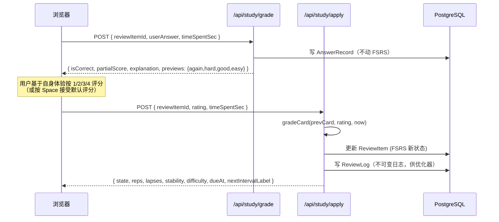

<p align="center">
  
</p>

<h1 align="center">Compass · 刷题罗盘</h1>

<p align="center">
  自托管的间隔重复刷题工具，跑 FSRS-6 算法，长航海仪器的样子。<br/>
  导入 Markdown / Excel / Word 题库 → 在键盘驱动的答题舱里做题 → 算法决定下一张卡什么时候回来。
</p>

<p align="center">
  <a href="LICENSE"></a>
  
  
  
  
  
  
  
</p>

<p align="center">
  <a href="#快速开始">快速开始</a> ·
  <a href="#题库导入">题库导入</a> ·
  <a href="#两阶段提交">两阶段提交</a> ·
  <a href="#架构总览">架构总览</a> ·
  <a href="#设计系统">设计系统</a> ·
  <a href="#路线图">路线图</a>
</p>

---

## 这是什么

刷题工具满大街都是，Compass 想解决的是另外两个问题：

1. **不想被某个 App 锁死。** 题库是你自己的，应该能自己导出、自己改、自己换工具。Compass 把题库做成纯文本友好——Markdown 写起来跟写笔记一样，Excel 直接贴，Word 文档拖进来就解析。数据库是 PostgreSQL，schema 全部开源，随时能 `pg_dump` 走人。
2. **复习节奏不想自己算。** Anki 的 SM-2 算法是 1985 年的，间隔重复这二十年有进展。Compass 用 [ts-fsrs](https://github.com/open-spaced-repetition/ts-fsrs) 实现的 FSRS-6（DSR 模型，21 个默认权重），把"我答得多准"和"这张卡下次什么时候回来"两件事拆开——你只管按 1/2/3/4 给自己的回忆打分，剩下的交给算法。

界面长航海仪器的样子，是因为作者觉得"罗盘 / 漂流瓶 / 航海日志"这些词天然契合"指引方向 / 错题本 / 答题记录"的功能定位，顺手就做了。

> **仓库镜像**
> - 主仓库（GitCode）：<https://gitcode.com/badhope/compass>
> - GitHub 镜像：<https://github.com/weed33834/compass>
>
> 两个仓库内容同步，PR 和 issue 都欢迎，主仓库合并后会自动同步到镜像。

---

## 核心能力

| 模块 | 路径 | 做什么 |
|---|---|---|
| 罗盘 | `/compass` | 今日待复习数、连续天数、题库舰队、一键开答 |
| 答题舱 | `/study` | 4 种题型、4 键 FSRS 评分（热键 1-4）、每键间隔预览、漏选部分给分、断点续答（localStorage 7 天）、完成报告 |
| 造船工坊 | `/workshop` | 题库 CRUD、拖拽导入（`.md/.txt/.xlsx/.csv/.docx`）、每库 FSRS 配置、题目分页列表 |
| 题库详情 | `/workshop/[id]` | 题目分页 + 搜索 + 类型筛选、**题目内联编辑**（4 题型 + 难度 + 收藏 + 启用 + 软删）、**每库 FSRS 调优**（开关 + 留存率 + 新题数 + 复习上限）、**CSV / Anki 导出** |
| 错题漂流瓶 | `/wrongbook` | `lapses > 0` 的卡会漂到这里，展开看答案和解析，可标"已掌握"或跳去重做 |
| 航海日志 | `/logbook` | 所有答题记录倒序时间线，按日聚合，可按题库筛选 |
| 航迹分析 | `/analytics` | 连续天数、正确率、FSRS 状态分布、**365 天答题热力图**、SVG 趋势图、按题型正确率、薄弱知识点 TOP10、记忆健康度（Retrievability 环形图 + 5 桶分布 + 7 天到期预测） |
| 账户中心 | `/account` | 个人资料、主题切换（深海 / 羊皮纸）、FSRS 参数预览、登出 |

### 4 种题型与判分规则

| 题型 | 答案形状 | 判分 |
|---|---|---|
| `SINGLE_CHOICE` 单选 | `"B"` | 全对 1.0，否则 0 |
| `MULTI_CHOICE` 多选 | `["A","C"]` | 全对 1.0；漏选 = `0.5 + (已选正确/应选正确) * 0.5`，上限 0.99；错选 = 0 |
| `TRUE_FALSE` 判断 | `true` / `false` | 全对 1.0，否则 0 |
| `FILL_BLANK` 填空 | `["北京"]` | 每空单独归一化（trim + lowercase + 全角转半角 + 折叠空白）；`|` 分隔可接受答案 |

---

## 两阶段提交

为了避免重复调度 FSRS（用户覆盖默认评分时算两次），答题流被拆成两个 API：



`grade` 阶段会根据 `partialScore` 自动映射一个默认评分（全对 → GOOD，部分对 → HARD，全错 → AGAIN），用户按 `Space` 就接受默认；想自己定就按 `1/2/3/4`。

---

## 快速开始

### 前置依赖

| 工具 | 最低版本 | 备注 |
|---|---|---|
| Node.js | 20 | 用 20.10+ 更稳 |
| pnpm | 9 | 11 也可以 |
| PostgreSQL | 17 | 16 也能跑，没强制 |

### 步骤

```bash
git clone https://gitcode.com/badhope/compass.git
cd compass
pnpm install
cp .env.example .env
# 编辑 .env，至少填这两项：
#   DATABASE_URL=postgresql://postgres:<你的密码>@localhost:5432/compass
#   NEXTAUTH_SECRET=<openssl rand -base64 32 生成>

pnpm db:generate
pnpm db:migrate
pnpm db:seed      # 可选：插 3 个示例题库共 60 题（FSRS / 中国地理 / TypeScript），覆盖 4 种题型
pnpm dev          # → http://localhost:3000
```

种子数据自带一个演示账号：`captain@compass.dev` / `Compass-Test-2026!`。生产环境请务必改掉或删除。

---

## 题库导入

### 官方题库（内置）

Compass 随仓库分发 4 个官方题库（Markdown 静态文件），位于 `public/official-banks/`：

| 题库 | 题数 | 覆盖范围 |
|------|------|----------|
| FSRS 与间隔重复入门 | 20 | FSRS-6 核心概念、DSR 模型、评分机制、参数优化 |
| 中国地理与人文常识 | 20 | 省级行政区、山川河流、世界遗产、节气民俗 |
| 编程基础与 TypeScript | 20 | 类型系统、泛型、异步、模块、最佳实践 |
| Python 编程基础 | 20 | 数据类型、控制流、函数、模块、面向对象、异常 |

进入 `/workshop` → 点击"官方题库"→ 选择题库 → 点击"加载"。题库文件随仓库分发，**不加载不占数据库**，加载时复用 Markdown 导入 API。

### Markdown（推荐）

```markdown
# 题库名（可选，第一行）

---

## 单选题

题干可以多行。

A. 选项 A
B. 选项 B
C. 选项 C
D. 选项 D

答案：B
解析：因为 B 是正确的。
难度：3
知识点：马原-辩证法, 真题-2024
来源：2024 国考真题

---

## 多选题

下列哪些是正确的？

A. 选项 A
B. 选项 B

答案：AC

---

## 判断题

地球是圆的。

答案：正确

---

## 填空题

中国的首都是____。

答案：北京
```

填空题支持多空（`||` 分隔）和可接受答案（`|` 分隔）：

```
答案：北京|Beijing||长江|Yangtze
```

### Excel / CSV

第一行是表头（不区分大小写，接受中文别名）：

| 列名 | 必填 | 内容 |
|---|---|---|
| `type` / `题型` | 是（或自动推断） | `单选` / `多选` / `判断` / `填空`（也接受英文） |
| `stem` / `题干` | 是 | 题干文本 |
| `options` / `选项` | 选择题必填 | `A.选项A|B.选项B|C.选项C`（管道符分隔） |
| `answer` / `答案` | 是 | 单选 `"B"` / 多选 `"AC"` 或 `"A,C"` / 判断 `"正确"` / 填空 `"北京||Beijing"` |
| `explanation` / `解析` | 选填 | Markdown |
| `difficulty` / `难度` | 选填 | 1-5 |
| `knowledge` / `知识点` | 选填 | 逗号分隔 |
| `source` / `来源` | 选填 | 自由文本 |

### Word (.docx)

两种写法都接受：

1. **Markdown 风格**——直接把上面的 Markdown 写进 Word 文档。
2. **纯文本风格**——每题之间空一行，每块第一行是题型标签（`单选题` / `判断题` / …），选项和答案跟 Markdown 同样的写法。

---

## 配置

所有环境变量都在 `.env.example` 里有说明。必填的三项：

| 变量 | 用途 |
|---|---|
| `DATABASE_URL` | PostgreSQL 连接串 |
| `NEXTAUTH_URL` | 部署地址（本地开发用 `http://localhost:3000`） |
| `NEXTAUTH_SECRET` | JWT 签名密钥，`openssl rand -base64 32` 生成 |

可选：SMTP 配置启用密码重置邮件；OAuth provider（GitHub、Google）启用第三方登录。

---

## 架构总览

```
src/
  app/
    (main)/              登录后的页面
      compass/           罗盘首页（今日概览 + 题库舰队）
      study/             答题舱（4 题型 + 4 键评分）
      workshop/          造船工坊（题库管理 + 导入）
        [id]/            题库详情（题目分页列表）
      wrongbook/         错题漂流瓶
      logbook/           航海日志
      analytics/         航迹分析
      account/           账户中心
    login/ register/     登录注册
    api/                 REST 端点
      banks/             题库 CRUD + 导入
      questions/         题目 CRUD
      study/             queue / grade / apply / sessions
      wrongbook/         错题列表 + 标记已掌握
      logbook/           答题历史
      analytics/         统计聚合
  components/
    AppShell.tsx         左侧导航 + 移动端底栏
    ui/                  Button / Card / Input / ...
  lib/
    auth.ts              NextAuth 配置
    prisma.ts            Prisma 单例
    fsrs.ts              FSRS-6 封装（grade / preview / format）
    quiz/
      grading.ts         4 题型统一判分
      scheduler.ts       每日队列构建（到期 + 新卡 + 错题重做）
      import/            Markdown / Excel / Word 解析器
prisma/
  schema.prisma          12 个模型
  seed.ts                示例题库
```

### 数据模型

| 模型 | 用途 |
|---|---|
| `User` | 账户、主题、语言 |
| `QuestionBank` | 题库，含每库 FSRS 配置（`newCardsPerDay` / `desiredRetention`） |
| `Question` | 题干、选项 JSON、答案 JSON、解析、知识点 |
| `ReviewItem` | 用户 × 题目 的 FSRS 卡片状态（stability / difficulty / reps / lapses / dueAt） |
| `ReviewLog` | 不可变复习日志，给 FSRS 优化器用 |
| `AnswerRecord` | 每次答题尝试，含部分得分和用时 |
| `QuizSession` | 可选的会话分组 |
| `SessionAnswer` | 会话内单题作答 |
| `FsrsParams` | 用户级 FSRS 权重（留给优化器） |
| `LearningPlan` | 学习计划（预留） |
| `AgentGenerationTask` | AI 智能体任务队列（V2 用） |
| `Notification` / `WeeklyReview` | 通知 + 周回顾（预留） |

### API 端点

- **认证** — `/api/auth/[...nextauth]`、`/api/auth/register`、`/api/auth/forgot-password`、`/api/auth/reset-password`
- **题库** — `/api/banks` (GET/POST)、`/api/banks/:id` (GET/PATCH/DELETE)、`/api/banks/:id/questions` (GET/POST)、`/api/banks/import` (POST multipart)
- **题目** — `/api/questions/:id` (GET/PATCH/DELETE)
- **答题** — `/api/study/queue`、`/api/study/grade`、`/api/study/apply`、`/api/study/sessions`
- **错题本** — `/api/wrongbook` (GET/PATCH)
- **日志** — `/api/logbook` (GET)
- **分析** — `/api/analytics` (GET)

---

## 技术栈

| 层 | 选型 | 版本 |
|---|---|---|
| 框架 | Next.js (App Router) | 16.2 |
| 语言 | TypeScript | 5.9 |
| 样式 | Tailwind CSS | 4.3 |
| ORM | Prisma | 5.22 |
| 数据库 | PostgreSQL | 17 |
| 认证 | NextAuth.js | 4.24 |
| 间隔重复 | ts-fsrs | 5.4 |
| Excel 解析 | xlsx | 0.18 |
| Word 解析 | mammoth | 1.12 |
| 动画 | framer-motion | 12.42 |
| 图标 | Lucide React | 1.23 |
| 校验 | Zod | 4.4 |

---

## 设计系统

界面借了航海和天文的语言——黄铜环、深渊背景、象牙白文字、珊瑚红警示。

**核心色板**

| Token | Hex | 用途 |
|---|---|---|
| `abyss` | `#0a0f14` | 背景深度 |
| `ivory` | `#f0ead6` | 主文字 |
| `brass` | `#c89b3c` | 交互高亮、导航 |
| `coral` | `#e0584a` | 破坏性操作、到期警示 |

**反馈色板**（4 键评分条 + 答题揭示）

| Token | Hex | 含义 |
|---|---|---|
| `f-emerald` | `#10b981` | EASY — 流畅回忆 |
| `f-azure` | `#38bdf8` | GOOD — 正常回忆 |
| `f-amber` | `#f59e0b` | HARD — 勉强答对 |
| `f-coral2` | `#ef4444` | AGAIN — 完全失忆 |

两套主题：
- **深海**（默认）—— 深渊背景 + 黄铜高亮 + 星点
- **羊皮纸** —— 暖米色背景 + 深棕文字 + 黄铜保留

字体只用系统原生字体——Georgia 衬线标题，system-ui 正文，ui-monospace 数据。没有任何外部 CDN 字体。

---

## 命令速查

| 命令 | 作用 |
|---|---|
| `pnpm dev` | 开发服务器（端口 3000） |
| `pnpm build` | 生产构建 |
| `pnpm start` | 启动生产服务器 |
| `pnpm lint` | ESLint |
| `pnpm typecheck` | TypeScript 类型检查（`tsc --noEmit`） |
| `pnpm test:api` | API 烟雾测试（需先启动 `pnpm dev` + 数据库） |
| `pnpm db:generate` | 生成 Prisma 客户端 |
| `pnpm db:migrate` | 跑数据库迁移（开发） |
| `pnpm db:deploy` | 部署迁移（生产） |
| `pnpm db:seed` | 插入示例题库 |
| `pnpm db:studio` | 启动 Prisma Studio GUI |

---

## 路线图

### V1 — 刷题地基（已完成）

- [x] FSRS-6 调度 + 4 键评分条
- [x] 4 种题型统一判分 + 漏选部分给分
- [x] Markdown / Excel / Word 导入
- [x] 错题漂流瓶 + 航海日志 + 航迹分析
- [x] 深海 / 羊皮纸 双主题

### V1.1 — 打磨（已完成）

- [x] 首次进入欢迎引导卡（localStorage 标记，可关闭）+ 题库舰队卡片升级（描述 / 标签 / 进度条）
- [x] 完成报告升级为学习画像：画像标签 + 题型掌握度 + FSRS 评分分布 + 薄弱知识点 TOP3 + 漏选提示 + 规则化建议
- [x] 种子题库扩容：12 题 → 60 题，覆盖 FSRS 概念 / 中国地理 / TypeScript 三类
- [x] 错题本逻辑修复：AGAIN 评分也入瓶（原先只有 FSRS lapse 入瓶，NEW/LEARNING 卡答错被漏掉）
- [x] LOGO 嵌入导航品牌区，移动端顶栏同步

### V1.2 — 记忆健康度与断点续答（已完成）

- [x] **记忆健康度（Retrievability）**：航迹分析新增 FSRS-6 衰退曲线可视化——平均记忆留存率环形图 + 5 桶分布（危急 / 脆弱 / 尚可 / 稳固 / 鲜活）+ 即将遗忘警示（R&lt;70%）+ 未来 7 天到期预测柱图
- [x] **断点续答**：答题中途退出后，下次进入 `/study` 检测到 localStorage 存档会弹"继续答题 / 放弃存档"对话框，存档保留 7 天自动过期，完成本轮答题自动清除
- [x] **开源仓库配套**：CI 工作流（typecheck + lint + build 三项门禁）+ Dependabot 显式禁用 + PR 模板补充 maintainer 自动化策略

### V1.3 — 工坊与分析增强（已完成）

- [x] **工坊题目内联编辑**：4 题型 + 难度 + 收藏 + 启用 + 软删，删除二次确认
- [x] **每库 FSRS 参数调优**：开关 / 留存率滑块 / 新题数 / 复习上限
- [x] **CSV / Anki 导出**：CSV 与导入兼容（带 BOM），Anki TSV 带 `#deck` / `#tags column` 头部
- [x] **分析页 365 天热力图**：GitHub 风格 4 色阶，月份 / 周标签，tooltip

### V1.4 — 官方题库按需加载（已完成）

- [x] **内置官方题库**：4 个题库（FSRS / 中国地理 / TypeScript / Python）以 Markdown 静态文件随仓库分发，`manifest.json` 索引
- [x] **按需加载 UI**：`/workshop` → "官方题库"对话框 → 点击加载，不点不占数据库
- [x] **seed 精简化**：不再自动插入题库，只创建 demo 用户 + FSRS 参数

### V2 — AI 智能体

- [ ] 上传资料 → 智能体自动生成题库
- [ ] 知识点自动打标
- [ ] 难度基于答题数据自动校准
- [ ] 基于个人复习日志的 FSRS 权重优化器

### V3 — 多端

- [ ] 微信小程序版本（共享 API + 设计 token）
- [ ] 移动端 PWA 调优
- [ ] 题库公开分享（只读链接）

---

## 贡献

欢迎提 issue 和 PR。提 PR 之前请先看 [CONTRIBUTING.md](CONTRIBUTING.md)——里面写了代码风格、提交规范、Quiz 逻辑路由规则（所有判分走 `src/lib/quiz/grading.ts`，所有 FSRS 调度走 `src/lib/fsrs.ts`，别在 route handler 里直接调 `ts-fsrs`）。

行为规范看 [CODE_OF_CONDUCT.md](CODE_OF_CONDUCT.md)。安全问题看 [SECURITY.md](SECURITY.md)——别开 public issue，按里面的流程私报。

---

## License

MIT，详见 [LICENSE](LICENSE)。
