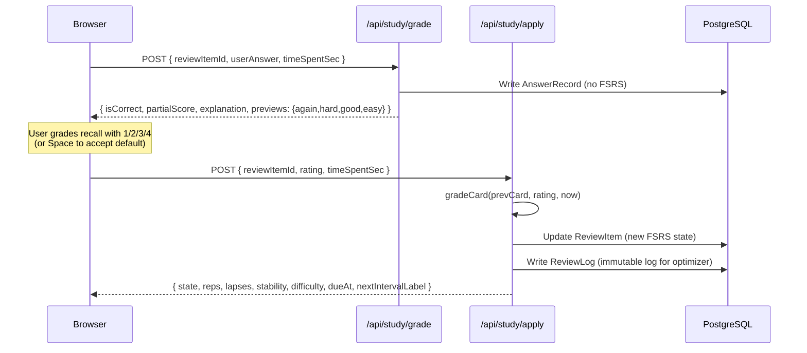

<p align="center">
  
</p>

<h1 align="center">Compass · Quiz Compass</h1>

<p align="center">
  A self-hosted spaced-repetition quiz tool powered by the FSRS-6 algorithm, wrapped in a nautical-instrument aesthetic.<br/>
  Import Markdown / Excel / Word question banks → answer in a keyboard-driven cockpit → let the algorithm decide when each card comes back.
</p>

<p align="center">
  <strong>English</strong> &nbsp;|&nbsp;
  <a href="README.zh-CN.md">简体中文</a> &nbsp;|&nbsp;
  <a href="README.ja.md">日本語</a>
</p>

<p align="center">
  <a href="LICENSE"></a>
  <a href="https://github.com/weed33834/compass/actions/workflows/ci.yml"></a>
  <a href="https://gitcode.com/badhope/compass/releases"></a>
  
  
  
  
  
  
  
  
  
</p>

<p align="center">
  <a href="#what-is-this">What is this</a> ·
  <a href="#quick-start">Quick Start</a> ·
  <a href="#docker-deployment">Docker</a> ·
  <a href="#question-bank-import">Import</a> ·
  <a href="#two-phase-submit">Architecture</a> ·
  <a href="#testing">Testing</a> ·
  <a href="#roadmap">Roadmap</a>
</p>

---

## What is this

Quiz tools are everywhere. Compass exists to solve two different problems:

1. **No vendor lock-in.** Your question banks belong to you — export them, edit them, switch tools. Compass treats banks as plain-text-friendly: Markdown reads like notes, Excel pastes right in, Word documents parse on drop. The database is PostgreSQL with a fully open schema; `pg_dump` and walk away anytime.
2. **Stop computing review intervals yourself.** Anki's SM-2 algorithm dates to 1985; spaced repetition has moved on. Compass runs [ts-fsrs](https://github.com/open-spaced-repetition/ts-fsrs) implementing FSRS-6 (DSR model, 21 default weights), separating *how accurately I recalled* from *when this card returns* — you just press 1/2/3/4 to grade your recall, the algorithm handles the rest.

The nautical-instrument aesthetic exists because *compass / drift bottle / logbook* map naturally onto *guidance / mistake book / answer history*.

> **Repository mirrors**
> - Primary (GitCode): <https://gitcode.com/badhope/compass>
> - GitHub mirror: <https://github.com/weed33834/compass>
>
> Both stay in sync. PRs and issues welcome on either.

---

## Core features

| Module | Route | What it does |
|---|---|---|
| Compass | `/compass` | Today's due count, streak days, bank fleet, one-click start |
| Study cockpit | `/study` | 4 question types, 4-key FSRS rating (hotkeys 1-4), per-key interval preview, partial credit for missed selections, resume-after-exit (localStorage 7-day), completion report |
| Workshop | `/workshop` | Bank CRUD, drag-and-drop import (`.md/.txt/.xlsx/.csv/.docx`), per-bank FSRS config, paginated question list |
| Bank detail | `/workshop/[id]` | Pagination + search + type filter, **inline question editing** (4 types + difficulty + star + enable + soft-delete), **per-bank FSRS tuning** (toggle + retention + new-cards/day + review cap), **CSV / Anki export** |
| Drift bottle | `/wrongbook` | Cards with `lapses > 0` drift here; expand to see answer/explanation, mark mastered or redo |
| Logbook | `/logbook` | All answer records in reverse-chronological timeline, grouped by day, filterable by bank |
| Analytics | `/analytics` | Streak, accuracy, FSRS state distribution, **365-day answer heatmap**, SVG trends, per-type accuracy, weak knowledge points TOP 10, memory health (Retrievability ring + 5-bucket distribution + 7-day due forecast) |
| Account | `/account` | Profile, theme switch (deep-sea / parchment), FSRS params preview, sign out |

### 4 question types & grading rules

| Type | Answer shape | Grading |
|---|---|---|
| `SINGLE_CHOICE` | `"B"` | Correct = 1.0, else 0 |
| `MULTI_CHOICE` | `["A","C"]` | All correct = 1.0; missed = `0.5 + (selected-correct / expected-correct) * 0.5`, capped at 0.99; wrong selection = 0 |
| `TRUE_FALSE` | `true` / `false` | Correct = 1.0, else 0 |
| `FILL_BLANK` | `["Beijing"]` | Each blank normalized independently (trim + lowercase + fullwidth→halfwidth + collapse whitespace); `\|` separates acceptable answers |

---

## Two-phase submit

To avoid double-scheduling FSRS (when the user overrides the default rating), the answer flow splits into two API calls:



The `grade` phase auto-maps a default rating from `partialScore` (all correct → GOOD, partial → HARD, all wrong → AGAIN). Press `Space` to accept the default, or `1/2/3/4` to override.

---

## Quick start

### Prerequisites

| Tool | Min version | Notes |
|---|---|---|
| Node.js | 22.13 | pnpm 11 depends on `node:sqlite`, requires Node 22+ |
| pnpm | 11 | Locked via `package.json` `packageManager` field; corepack auto-installs |
| PostgreSQL | 17 | 16 works too, not enforced |

### Steps

```bash
git clone https://gitcode.com/badhope/compass.git
cd compass
pnpm install
cp .env.example .env
# Edit .env, at minimum set:
#   DATABASE_URL=postgresql://postgres:<password>@localhost:5432/compass
#   NEXTAUTH_SECRET=<generate with: openssl rand -base64 32>

pnpm db:generate
pnpm db:migrate
pnpm db:seed      # Optional: 3 sample banks, 60 questions total (FSRS / China geography / TypeScript), covers all 4 types
pnpm dev          # → http://localhost:3000
```

The seed includes a demo account: `captain@compass.dev` / `Compass-Test-2026!`. Change or delete it in production.

---

## Docker deployment

Skip installing Node.js / PostgreSQL locally — Docker Compose gets you running in three steps:

```bash
git clone https://gitcode.com/badhope/compass.git
cd compass
cp .env.example .env
# At minimum change:
#   NEXTAUTH_URL=http://your-domain-or-ip:3000
#   NEXTAUTH_SECRET=$(openssl rand -base64 32)
#   POSTGRES_PASSWORD=<strong password>

docker compose up -d --build
```

Visit `http://localhost:3000`. The container automatically:

1. Waits for PostgreSQL healthcheck (up to 60s)
2. Runs `prisma migrate deploy` (applies all migrations)
3. Starts the Next.js standalone production server

### What's included

| Container | Image | Purpose |
|---|---|---|
| `compass-db` | `postgres:17-alpine` | Database with persistent volume |
| `compass-app` | Built from this repo's `Dockerfile` | Compass itself (non-root user, tini as init) |
| `compass-caddy` (optional) | `caddy:2-alpine` | Auto-HTTPS reverse proxy + security headers, recommended for production |

### Production checklist

- [ ] Set `NEXTAUTH_URL` to your actual access domain
- [ ] Generate `NEXTAUTH_SECRET` with `openssl rand -base64 32`
- [ ] Set `POSTGRES_PASSWORD` to a strong password
- [ ] Uncomment the `caddy` section in `docker-compose.yml`, configure `DOMAIN`, enable auto-HTTPS
- [ ] Behind a reverse proxy? Set `TRUSTED_PROXY_IPS` to the proxy IP (comma-separated), otherwise rate limiting may be inaccurate
- [ ] (Optional) Configure `SMTP_URL` for password-reset emails

### Image features

- **Multi-stage build**: `deps → builder → runner`; final image contains only standalone output + necessary node_modules, ~200MB
- **Non-root runtime**: `node:22-alpine` + `node` user, least privilege
- **tini as PID 1**: Proper signal handling + zombie reaping
- **HEALTHCHECK**: Built-in `/api/health` probe, ready for K8s / Docker Swarm
- **docker-entrypoint.sh**: Wait for DB → migrate → start, safe boot order

> Prefer manual commands? `docker build -t compass .` then `docker run -p 3000:3000 --env-file .env compass` works too — just bring your own PostgreSQL.

---

## Question bank import

### Official banks (built-in)

Compass ships 4 official banks as Markdown static files in `public/official-banks/`:

| Bank | Questions | Coverage |
|------|-----------|----------|
| FSRS & spaced-repetition intro | 20 | FSRS-6 core concepts, DSR model, rating mechanics, parameter optimization |
| China geography & culture | 20 | Provincial regions, rivers & mountains, world heritage, solar terms & folklore |
| Programming basics & TypeScript | 20 | Type system, generics, async, modules, best practices |
| Python programming basics | 20 | Data types, control flow, functions, modules, OOP, exceptions |

Go to `/workshop` → click "Official Banks" → pick a bank → click "Load". Bank files ship with the repo and **consume no database space until loaded**; loading reuses the Markdown import API.

### Markdown (recommended)

```markdown
# Bank name (optional, first line)

---

## Single choice

The stem can span multiple lines.

A. Option A
B. Option B
C. Option C
D. Option D

Answer: B
Explanation: Because B is correct.
Difficulty: 3
Knowledge: algebra-basics, exam-2024
Source: 2024 national exam

---

## Multiple choice

Which of the following are correct?

A. Option A
B. Option B

Answer: AC

---

## True / False

The Earth is round.

Answer: True

---

## Fill in the blank

The capital of China is ____.

Answer: Beijing
```

Fill-blank supports multiple blanks (`||` separated) and acceptable answers (`|` separated):

```
Answer: Beijing|Beijing||Yangtze|Yangtze River
```

### Excel / CSV

First row is the header (case-insensitive, accepts Chinese aliases):

| Column | Required | Content |
|---|---|---|
| `type` | Yes (or auto-inferred) | `single` / `multi` / `true-false` / `fill-blank` (also accepts Chinese) |
| `stem` | Yes | Question text |
| `options` | Required for choice types | `A.Option A|B.Option B|C.Option C` (pipe-separated) |
| `answer` | Yes | Single `"B"` / Multi `"AC"` or `"A,C"` / Boolean `"True"` / Fill `"Beijing||Yangtze"` |
| `explanation` | Optional | Markdown |
| `difficulty` | Optional | 1-5 |
| `knowledge` | Optional | Comma-separated |
| `source` | Optional | Free text |

### Word (.docx)

Both styles accepted:

1. **Markdown style** — paste the Markdown above directly into a Word document.
2. **Plain-text style** — separate questions with blank lines; each block starts with a type label (`Single choice` / `True/False` / …); options and answers follow the same format as Markdown.

---

## Configuration

All environment variables are documented in `.env.example`. The three required ones:

| Variable | Purpose |
|---|---|
| `DATABASE_URL` | PostgreSQL connection string |
| `NEXTAUTH_URL` | Deployment URL (`http://localhost:3000` for local dev) |
| `NEXTAUTH_SECRET` | JWT signing key, generate with `openssl rand -base64 32` |

Optional: SMTP config enables password-reset emails; OAuth providers (GitHub, Google) enable third-party login.

---

## Architecture overview

```
src/
  app/
    (main)/              Authenticated pages
      compass/           Home dashboard (today's overview + bank fleet)
      study/             Study cockpit (4 types + 4-key rating)
      workshop/          Workshop (bank management + import)
        [id]/            Bank detail (paginated question list)
      wrongbook/         Drift bottle (mistake book)
      logbook/           Logbook (answer history)
      analytics/         Analytics (stats + heatmap)
      account/           Account center
    login/ register/     Auth pages
    api/                 REST endpoints
      banks/             Bank CRUD + import
      questions/         Question CRUD
      study/             queue / grade / apply / sessions
      wrongbook/         Mistake list + mark mastered
      logbook/           Answer history
      analytics/         Stats aggregation
  components/
    AppShell.tsx         Left nav + mobile bottom bar
    ui/                  Button / Card / Input / ...
  lib/
    auth.ts              NextAuth config
    prisma.ts            Prisma singleton
    fsrs.ts              FSRS-6 wrapper (grade / preview / format)
    quiz/
      grading.ts         Unified 4-type grading
      scheduler.ts       Daily queue builder (due + new + mistake redo)
      import/            Markdown / Excel / Word parsers
prisma/
  schema.prisma          12 models
  seed.ts                Sample banks
```

### Data models

| Model | Purpose |
|---|---|
| `User` | Account, theme, language |
| `QuestionBank` | Bank with per-bank FSRS config (`newCardsPerDay` / `desiredRetention`) |
| `Question` | Stem, options JSON, answer JSON, explanation, knowledge points |
| `ReviewItem` | User × question FSRS card state (stability / difficulty / reps / lapses / dueAt) |
| `ReviewLog` | Immutable review log for the FSRS optimizer |
| `AnswerRecord` | Each answer attempt, including partial score and time spent |
| `QuizSession` | Optional session grouping |
| `SessionAnswer` | Single answer within a session |
| `FsrsParams` | User-level FSRS weights (for optimizer) |
| `LearningPlan` | Study plan (reserved) |
| `AgentGenerationTask` | AI agent task queue (V2) |
| `Notification` / `WeeklyReview` | Notifications + weekly review (reserved) |

### API endpoints

- **Auth** — `/api/auth/[...nextauth]`, `/api/auth/register`, `/api/auth/forgot-password`, `/api/auth/reset-password`
- **Banks** — `/api/banks` (GET/POST), `/api/banks/:id` (GET/PATCH/DELETE), `/api/banks/:id/questions` (GET/POST), `/api/banks/import` (POST multipart)
- **Questions** — `/api/questions/:id` (GET/PATCH/DELETE)
- **Study** — `/api/study/queue`, `/api/study/grade`, `/api/study/apply`, `/api/study/sessions`
- **Wrong book** — `/api/wrongbook` (GET/PATCH)
- **Logbook** — `/api/logbook` (GET)
- **Analytics** — `/api/analytics` (GET)
- **Health** — `/api/health` (GET) → Docker / K8s probe

---

## Testing

Compass maintains three test layers; CI runs the first two on every push / PR:

### Unit tests (no DB required, CI mandatory)

`pnpm test:unit` runs 49 pure-logic tests across three core modules:

| Test file | Count | Coverage |
|---|---|---|
| `scripts/grading-test.ts` | 13 | 4-type grading: single / multi (partial credit for missed) / true-false (CN+EN booleans) / fill-blank (multi-blank + `\|` equivalent answers + normalization) |
| `scripts/fsrs-test.ts` | 19 | Prisma string-enum ↔ ts-fsrs numeric State bidirectional conversion, `dbRowToCard` / `cardToDbUpdate`, `gradeCard` scheduling, `previewIntervals`, `formatInterval`, `scoreToRating` mapping |
| `scripts/parser-test.ts` | 17 | Markdown / Excel / Word parsers: valid parsing, empty/binary/unknown-extension rejection, missing-answer warnings, answer-not-in-options warnings, numbering format compat |

Tests use `node:assert` with no test-framework dependency; `tsx` runs them directly.

### API smoke tests (requires dev server + DB)

`pnpm test:api` runs `scripts/api-test.ts`, covering unauthenticated interception, NextAuth login, bank CRUD, two-phase submit, wrong book, logbook, analytics — 7 groups. Requires `pnpm dev` + a ready database first.

### E2E tests (Playwright, requires dev server + DB)

Four Playwright suites under `tests/e2e/` simulate real user clicks:

| File | Cases | Coverage |
|---|---|---|
| `visual-walkthrough.spec.ts` | 15 | Full-site visual walkthrough: landing / login / register / compass / workshop / study / wrongbook / logbook / analytics / account / 404 |
| `import-flow.spec.ts` | 7 | Bank import: valid Markdown / CSV / Word, empty/binary/unknown-extension rejection, warning prompts |
| `answering-flow.spec.ts` | 5 | Full answer flow: start / answer all / completion report / replay / mistake redo |
| `full-flow.spec.ts` | — | End-to-end full-flow chain |

Run E2E: `pnpm exec playwright test` (configure `playwright.config.ts` baseURL first).

### CI strategy

CI (`.github/workflows/ci.yml`) keeps automation to a minimum — **no** auto-publish / deploy / dependency updates / auto-merge / bot comments:

- `push` / `PR` to `main` → `install → db:generate → typecheck → lint → test:unit → build`
- `push` to `main` → additionally runs `docker-build` job to verify the Dockerfile builds
- Dependabot explicitly disabled (`.github/dependabot.yml` `updates: []`); dependencies reviewed manually by the maintainer
- New commits on the same branch cancel old runs to save CI quota

---

## Tech stack

| Layer | Choice | Version |
|---|---|---|
| Framework | Next.js (App Router) | 16.2.11 |
| Language | TypeScript | 5.9 |
| Styling | Tailwind CSS | 4.3.3 |
| ORM | Prisma | 5.22 |
| Database | PostgreSQL | 17 |
| Auth | NextAuth.js | 4.24.15 |
| Spaced repetition | ts-fsrs | 5.4 |
| UI primitives | Radix UI | 1.1.21 |
| Excel parsing | xlsx | 0.18 |
| Word parsing | mammoth | 1.12 |
| Animation | framer-motion | 12.42 |
| Icons | Lucide React | 1.25 |
| Validation | Zod | 4.4 |
| Runtime | Node.js | ≥22.13 |

---

## Design system

The interface borrows nautical and astronomical language — brass rings, abyss backgrounds, ivory text, coral alerts.

**Core palette**

| Token | Hex | Usage |
|---|---|---|
| `abyss` | `#0a0f14` | Background depth |
| `ivory` | `#f0ead6` | Primary text |
| `brass` | `#c89b3c` | Interactive highlights, navigation |
| `coral` | `#e0584a` | Destructive actions, due alerts |

**Feedback palette** (4-key rating bar + answer reveal)

| Token | Hex | Meaning |
|---|---|---|
| `f-emerald` | `#10b981` | EASY — fluent recall |
| `f-azure` | `#38bdf8` | GOOD — normal recall |
| `f-amber` | `#f59e0b` | HARD — barely correct |
| `f-coral2` | `#ef4444` | AGAIN — total lapse |

Two themes:
- **Deep sea** (default) — abyss background + brass highlights + starfield
- **Parchment** — warm cream background + dark brown text + brass retained

Fonts use only system-native families — Georgia serif for headings, system-ui for body, ui-monospace for data. No external CDN fonts.

---

## Command reference

| Command | Purpose |
|---|---|
| `pnpm dev` | Dev server (port 3000) |
| `pnpm build` | Production build |
| `pnpm start` | Start production server |
| `pnpm lint` | ESLint |
| `pnpm typecheck` | TypeScript type check (`tsc --noEmit`) |
| `pnpm test:unit` | Unit tests (grading + FSRS + parsers, no DB) |
| `pnpm test:grading` | Run only grading unit tests |
| `pnpm test:fsrs` | Run only FSRS state-mapping unit tests |
| `pnpm test:parser` | Run only import-parser unit tests |
| `pnpm test:api` | API smoke tests (requires `pnpm dev` + DB) |
| `pnpm db:generate` | Generate Prisma client |
| `pnpm db:migrate` | Run database migrations (dev) |
| `pnpm db:deploy` | Deploy migrations (production) |
| `pnpm db:seed` | Insert sample banks |
| `pnpm db:studio` | Launch Prisma Studio GUI |

---

## Roadmap

### V1 — Quiz foundation (done)

- [x] FSRS-6 scheduling + 4-key rating bar
- [x] 4 question types with unified grading + partial credit for missed selections
- [x] Markdown / Excel / Word import
- [x] Drift bottle (mistake book) + logbook + analytics
- [x] Deep-sea / parchment dual themes

### V1.1 — Polish (done)

- [x] First-visit welcome guide card (localStorage flag, dismissible) + upgraded bank fleet cards (description / tags / progress bar)
- [x] Completion report upgraded to learning profile: profile tags + per-type mastery + FSRS rating distribution + weak knowledge TOP 3 + missed-selection hints + actionable advice
- [x] Seed banks expanded: 12 → 60 questions across FSRS concepts / China geography / TypeScript
- [x] Wrong-book logic fix: AGAIN rating also enters the bottle (previously only FSRS lapses did; NEW/LEARNING cards answered wrong were missed)
- [x] Logo embedded in nav brand area, synced to mobile top bar

### V1.2 — Memory health & resume (done)

- [x] **Memory health (Retrievability)**: analytics gains FSRS-6 decay curve visualization — average retention ring + 5-bucket distribution (critical / fragile / fair / stable / fresh) + forgetting alerts (R<70%) + 7-day due forecast bar chart
- [x] **Resume after exit**: leaving mid-study and returning to `/study` detects a localStorage save and prompts "continue / discard"; saves expire after 7 days, cleared on round completion
- [x] **Open-source housekeeping**: CI workflow (typecheck + lint + build gates) + Dependabot explicitly disabled + PR template documents maintainer automation policy

### V1.3 — Workshop & analytics enhancements (done)

- [x] **Inline question editing**: 4 types + difficulty + star + enable + soft-delete, with delete confirmation
- [x] **Per-bank FSRS tuning**: toggle / retention slider / new-cards-per-day / review cap
- [x] **CSV / Anki export**: CSV import-compatible (with BOM), Anki TSV with `#deck` / `#tags` column headers
- [x] **Analytics 365-day heatmap**: GitHub-style 4-color scale, month/week labels, tooltip

### V1.4 — Official banks on-demand (done)

- [x] **Built-in official banks**: 4 banks (FSRS / China geography / TypeScript / Python) shipped as Markdown static files with `manifest.json` index
- [x] **On-demand load UI**: `/workshop` → "Official Banks" dialog → click to load; no database footprint until loaded
- [x] **Slimmed seed**: no longer auto-inserts banks, only creates the demo user + FSRS params

### V1.4.1 — Production hardening (done)

- [x] **Docker one-click deploy**: multi-stage Dockerfile + docker-compose (app + db + optional caddy) + docker-entrypoint.sh + `/api/health` probe
- [x] **3 Critical fixes**: FSRS State string/numeric type mismatch breaking scheduling, missing FK cascade on bank deletion, no idempotency on apply
- [x] **6 High fixes**: analytics N+1 query (365 → 1), wrong-book errorReason persistence, IP trust-chain security, grade double-counting, timeSpentSec clamp, forgot-password status code
- [x] **49 unit tests**: grading 13 + FSRS state mapping 19 + parsers 17, CI mandatory
- [x] **CI hardening**: new `test:unit` step + `docker-build` job verifying Dockerfile builds

### V2 — AI agent

- [ ] Upload materials → agent auto-generates question banks
- [ ] Auto-tagging of knowledge points
- [ ] Difficulty auto-calibration from answer data
- [ ] Personal FSRS weight optimizer based on review logs

### V3 — Multi-platform

- [ ] WeChat mini-program (shared API + design tokens)
- [ ] Mobile PWA tuning
- [ ] Public bank sharing (read-only links)

---

## Contributing

Issues and PRs welcome. Before opening a PR, read [CONTRIBUTING.md](CONTRIBUTING.md) — it covers code style, commit conventions, and the quiz-logic routing rules (all grading goes through `src/lib/quiz/grading.ts`, all FSRS scheduling through `src/lib/fsrs.ts`; don't call `ts-fsrs` directly from route handlers).

See [CODE_OF_CONDUCT.md](CODE_OF_CONDUCT.md) for conduct. For security issues, see [SECURITY.md](SECURITY.md) — do not open a public issue; follow the private disclosure process.

---

## License

MIT — see [LICENSE](LICENSE).
