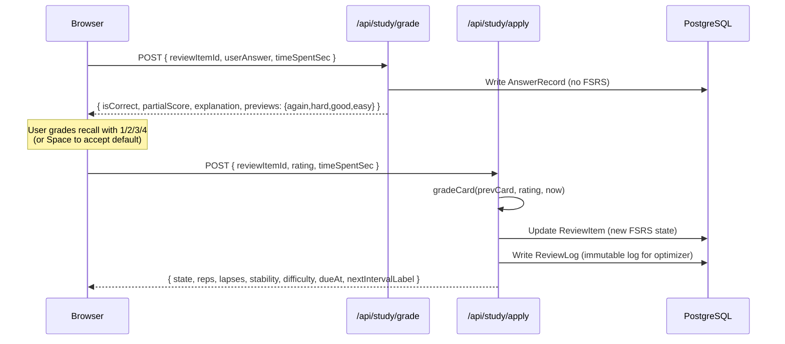
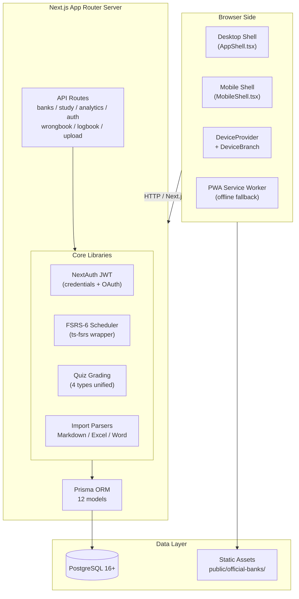
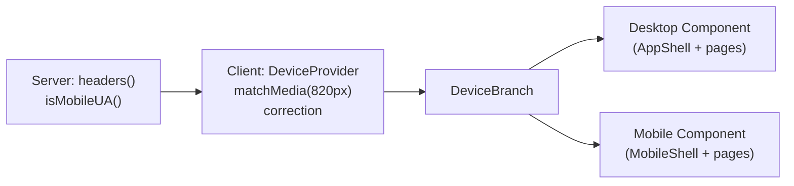

<p align="center">
  
</p>

<h1 align="center">Compass · Quiz Compass</h1>

[English](README.md) | [中文](README.zh.md) | [日本語](README.ja.md)

<p align="center">
  A self-hosted, FSRS-6 spaced-repetition quiz tool with a nautical-instrument design.<br/>
  Import Markdown / Excel / Word banks → answer in a keyboard-driven cockpit → let the algorithm schedule every review.
</p>

<p align="center">
  <a href="LICENSE"></a>
  <a href="#"></a>
  <a href="https://gitcode.com/badhope/compass/releases"></a>
  
  
  
  
  
  
  
  
  
</p>

<p align="center">
  <a href="#what-is-this">What is this</a> ·
  <a href="#for-learners">For Learners</a> ·
  <a href="#core-features">Features</a> ·
  <a href="#device-aware-mobile-adaptation">Mobile</a> ·
  <a href="#quick-start">Quick Start</a> ·
  <a href="#deployment">Deploy</a> ·
  <a href="#architecture-overview">Architecture</a> ·
  <a href="#testing">Tests</a> ·
  <a href="#roadmap">Roadmap</a>
</p>

---

## What is this

Compass ("刷题罗盘" — quiz compass) is a self-hosted, open-source alternative to proprietary quiz apps. It solves two problems:

1. **No vendor lock-in.** Your question banks belong to you. Import Markdown (reads like notes), Excel (paste right in), or Word (drag & drop). Export any time. PostgreSQL with a fully open schema — `pg_dump` and walk away.

2. **Don't compute review intervals yourself.** Anki's SM-2 dates to 1985; spaced repetition has advanced. Compass uses [ts-fsrs](https://github.com/open-spaced-repetition/ts-fsrs) implementing **FSRS-6** (DSR model, 21 default weights). It separates *how accurately you recalled* from *when the card returns* — press 1-4 to grade, the algorithm handles scheduling.

The nautical naming — Compass (guidance), Drift Bottle (wrong book), Logbook (answer history), Voyage (study plan) — maps naturally onto the app's functions.

> **Repository**: [https://gitcode.com/badhope/compass](https://gitcode.com/badhope/compass)

---

## For Learners

### How to use Compass in 5 steps

1. **Sign up** — visit `/register`, create an account. (Or use the demo: `captain@compass.dev` / `Compass-Test-2026!`)
2. **Import a question bank** — go to `/workshop`, open "Official Banks", pick one (FSRS, Geography, TypeScript, Python) and click "Load". Or drag a `.md` / `.xlsx` / `.docx` file onto the page.
3. **Start studying** — click the "Start" button on the Compass dashboard (`/compass`). The algorithm pulls due cards into your queue.
4. **Answer & rate** — type your answer, press `Enter` to submit. Then rate how well you recalled using the 4-key dock (or keyboard 1-4):
   - `1` **Again** — total lapse, card resets
   - `2` **Hard** — barely recalled, short interval
   - `3` **Good** (default) — normal recall, normal interval
   - `4` **Easy** — fluent, long interval
5. **Review & analyze** — check the Drift Bottle (`/wrongbook`) for accumulated mistakes, or Analytics (`/analytics`) for memory health, streak, heatmap, and FSRS state distribution.

> 💡 The app automatically switches between **desktop** and **mobile** layouts based on your device. On mobile, use the bottom navigation bar and swipe to advance through questions.

---

## Core features

| Module | Route | What it does |
|---|---|---|
| **Compass** (dashboard) | `/compass` | Today's due count, streak, bank fleet, one-click start |
| **Study cockpit** | `/study` | 4 question types, 4-key FSRS rating (hotkeys 1-4), interval preview, partial credit, resume-after-exit, completion report |
| **Workshop** | `/workshop` | Bank CRUD, drag-drop import (`.md/.txt/.xlsx/.csv/.docx`), official banks on-demand loader, per-bank FSRS config |
| **Bank detail** | `/workshop/[id]` | Inline question editing, CSV/Anki export, FSRS tuning (retention/new-cards/review cap) |
| **Drift bottle** (wrong book) | `/wrongbook` | Cards with lapses > 0; review, mark mastered, or re-answer |
| **Logbook** | `/logbook` | All answer records in reverse-chronological timeline, filterable by bank |
| **Analytics** | `/analytics` | Streak, accuracy, FSRS state distribution, 365-day heatmap, memory health (retrievability ring + 5-bucket distribution + 7-day forecast), weak knowledge TOP 10 |
| **Account** | `/account` | Profile, dual-theme switch (deep-sea / parchment), FSRS params preview, language toggle |

### 4 question types & grading rules

| Type | Answer shape | Grading |
|---|---|---|
| `SINGLE_CHOICE` | `"B"` | Correct = 1.0, else 0 |
| `MULTI_CHOICE` | `["A","C"]` | All correct = 1.0;\n missed = `0.5 + (selected-correct / expected-correct) * 0.5`, capped at 0.99;\n wrong selection = 0 |
| `TRUE_FALSE` | `true` / `false` | Correct = 1.0, else 0 |
| `FILL_BLANK` | `["Beijing"]` | Each blank: trim + lowercase + fullwidth→halfwidth + collapse whitespace; `\|` separates acceptable answers |

---

## Device-aware mobile adaptation

Compass uses a **DeviceBranch** pattern — the same URL renders **completely independent component trees** for desktop vs. mobile, not CSS responsive scaling.

```
Server-side UA detection → isMobileUA()
         ↓
Browser matchMedia (820px) correction
         ↓
    DeviceProvider (React context)
         ↓
    DeviceBranch({mobile, desktop})
```

- **Desktop**: `AppShell` — left nav sidebar, wide layout, keyboard-focused interaction.
- **Mobile**: `MobileShell` — bottom 4-tab nav + FAB, touch-optimized card layout, swipe-to-advance, `safe-area-inset` support.

All 12 app routes (`login`, `register`, `compass`, `study`, `workshop`, `wrongbook`, `logbook`, `analytics`, `account`, `forgot-password`, `reset-password`, `bank-detail`) have independent mobile pages.

---

## Two-phase submit

To avoid double-scheduling FSRS (when the user overrides the default rating), the answer flow splits into two API calls:


```mermaid
sequenceDiagram
    participant U as Browser
    participant G as /api/study/grade
    participant A as /api/study/apply
    participant DB as PostgreSQL

    U->>G: POST { reviewItemId, userAnswer, timeSpentSec }
    G->>DB: Write AnswerRecord (no FSRS)
    G-->>U: { isCorrect, partialScore, explanation, previews: {again,hard,good,easy} }

    Note over U: User grades recall with 1/2/3/4<br/>(or Space to accept default)

    U->>A: POST { reviewItemId, rating, timeSpentSec }
    A->>A: gradeCard(prevCard, rating, now)
    A->>DB: Update ReviewItem (new FSRS state)
    A->>DB: Write ReviewLog (immutable log for optimizer)
    A-->>U: { state, reps, lapses, stability, difficulty, dueAt, nextIntervalLabel }
```

The `grade` phase auto-maps a default rating from `partialScore` (all correct → GOOD, partial → HARD, all wrong → AGAIN). Press `Space` to accept the default, or `1/2/3/4` to override.

---

## Quick start

### Prerequisites

| Tool | Min version | Notes |
|---|---|---|
| Node.js | 22.13 | Required by pnpm 11 |
| pnpm | 11 | Locked via `package.json` `packageManager`; corepack auto-installs |
| PostgreSQL | 16+ | 17 works too |

### Local development

```bash
git clone https://gitcode.com/badhope/compass.git
cd compass
pnpm install
cp .env.example .env
# Edit .env — at minimum set:
#   DATABASE_URL      postgresql://postgres:<password>@localhost:5432/compass?schema=public
#   NEXTAUTH_SECRET   openssl rand -base64 32

pnpm db:generate
pnpm db:migrate
pnpm db:seed          # Creates demo user + FSRS params (no banks in seed)
pnpm dev              # → http://localhost:3000
```

The seed creates a demo account: `captain@compass.dev` / `Compass-Test-2026!`. Change or delete it in production.

### Import official banks

```bash
pnpm exec tsx scripts/import-official-banks.mjs
```

This logs in as the demo user and loads all 4 official banks (FSRS intro, China geography, TypeScript, Python) into your workshop — 80 questions total, ready to study.

---

## Deployment

### Docker (self-hosted, recommended)

The repo ships a ready-to-use `Dockerfile` + `docker-compose.yml`:

```bash
cp .env.example .env
# Edit .env — set DATABASE_URL to use the 'db' service (see note below)
docker compose up -d --build
docker compose run --rm app pnpm prisma migrate deploy
docker compose exec app node scripts/import-official-banks.mjs
```

> In `docker-compose.yml`, the app connects to the `db` service via the internal Docker network:\
> `DATABASE_URL=postgresql://compass:change-me@db:5432/compass?schema=public`

A sample `Caddyfile` is provided for reverse-proxy + auto-TLS (Let's Encrypt) in production.

### Cloud platforms

See [DEPLOYMENT.md](DEPLOYMENT.md) for three deployment options with detailed steps:

| Option | Best for | Database |
|---|---|---|
| **Vercel + Neon** | Fast launch, serverless | Neon (serverless Postgres) |
| **Railway / Render** | All-in-one with managed DB | Built-in Postgres |
| **Self-host VPS + Docker** | Full control, privacy | Your own Postgres |

> ⚠️ **Known limitation**: The `POST /api/upload` endpoint writes media (images/audio for question stems) to `public/uploads/` at runtime. On serverless platforms (Vercel) this storage is ephemeral — uploaded files are lost on cold start. For full file upload support, use Docker with a persistent volume, or replace the upload handler with S3/R2 storage.

---

## Question bank import

### Official banks (built-in)

Compass ships 4 official banks as Markdown static files in `public/official-banks/`. Load them from the Workshop page ("Official Banks" dialog) or via the import script above — no database footprint until loaded.

| Bank | Questions | Coverage |
|---|---|---|
| FSRS & Spaced Repetition | 20 | DSR model, rating mechanics, weight tuning |
| China Geography & Culture | 20 | Provinces, rivers, heritage, folklore |
| Programming Basics & TypeScript | 20 | Type system, generics, async, modules |
| Python Programming | 20 | Data types, OOP, exceptions, standard lib |

### Markdown format (recommended)

```markdown
# Bank name (optional, first line)

---

## Single choice

The stem can span multiple lines.

A. Option A
B. Option B
C. Option C
D. Option D

Answer: B
Explanation: Because B is correct.
Difficulty: 3
Knowledge: algebra-basics
Source: 2024 exam

---

## Multiple choice

Which of the following are correct?

A. Option A
B. Option B

Answer: AC
```

Fill-blank supports multiple blanks (`||` separated) and acceptable answers (`|` separated):

```
Answer: Beijing|Beijing||Yangtze|Yangtze River
```

### Excel / CSV / Word

See [the existing import documentation](#question-bank-import) — all formats support Chinese column aliases, auto-inferred types, and pipe-separated options.

---

## Configuration

All environment variables are documented in `.env.example`. Required ones:

| Variable | Purpose |
|---|---|
| `DATABASE_URL` | PostgreSQL connection string (Prisma format) |
| `NEXTAUTH_URL` | Deployment URL (must be `https://` in production) |
| `NEXTAUTH_SECRET` | JWT signing key — `openssl rand -base64 32` |
| `NEXT_PUBLIC_SITE_URL` | Public URL for SEO metadataBase / canonical / sitemap |

Optional: SMTP for password-reset emails, OAuth providers (GitHub/Google) for third-party login, OpenAI for AI-powered question generation.

---

## Architecture overview


```mermaid
graph TB
    subgraph Client["Browser Side"]
        DS["Desktop Shell<br/>(AppShell.tsx)"]
        MS["Mobile Shell<br/>(MobileShell.tsx)"]
        DP["DeviceProvider<br/>+ DeviceBranch"]
        PW["PWA Service Worker<br/>(offline fallback)"]
    end

    subgraph Server["Next.js App Router Server"]
        direction TB
        API["API Routes<br/>banks / study / analytics / auth<br/>wrongbook / logbook / upload"]
        
        subgraph Lib["Core Libraries"]
            NA["NextAuth JWT<br/>(credentials + OAuth)"]
            Fs["FSRS-6 Scheduler<br/>(ts-fsrs wrapper)"]
            PG["Quiz Grading<br/>(4 types unified)"]
            Pars["Import Parsers<br/>Markdown / Excel / Word"]
        end

        ORM["Prisma ORM<br/>12 models"]
    end

    subgraph Storage["Data Layer"]
        DB[("PostgreSQL 16+")]
        ST["Static Assets<br/>public/official-banks/"]
    end

    Client -- "HTTP / Next.js Router" --> Server
    API --> Lib
    Lib --> ORM
    ORM --> DB
    Client --> ST
```

### Device detection flow


```mermaid
flowchart LR
    SR["Server: headers()<br/>isMobileUA()"] --> CP["Client: DeviceProvider<br/>matchMedia(820px)<br/>correction"]
    CP --> DB["DeviceBranch"]
    DB --> DT["Desktop Component<br/>(AppShell + pages)"]
    DB --> MB["Mobile Component<br/>(MobileShell + pages)"]
```

### Data models

| Model | Purpose |
|---|---|
| `User` | Account, theme, language, FSRS weights |
| `QuestionBank` | Bank with per-bank FSRS config (newCardsPerDay, retention) |
| `Question` | Stem, options (JSON), answer (JSON), explanation, knowledge points |
| `ReviewItem` | User × question FSRS card state (stability, difficulty, dueAt) |
| `ReviewLog` | Immutable review log for FSRS optimizer |
| `AnswerRecord` | Each answer attempt with partial score and time spent |
| `QuizSession` / `SessionAnswer` | Session grouping (optional) |
| `FsrsParams` | User FSRS weights |
| `AgentGenerationTask` | AI agent task queue |

### API endpoints

| Endpoint | Method | Purpose |
|---|---|---|
| `/api/auth/[...nextauth]` | * | NextAuth: login, session, JWT |
| `/api/auth/register` | POST | Email registration |
| `/api/auth/forgot-password` | POST | Send reset email |
| `/api/auth/reset-password` | POST | Reset password |
| `/api/banks` | GET/POST | List / create banks |
| `/api/banks/:id` | GET/PATCH/DELETE | Bank CRUD |
| `/api/banks/:id/questions` | GET/POST | Question list / create |
| `/api/banks/import` | POST | Multipart import (MD/XLSX/DOCX) |
| `/api/banks/:id/export` | GET | CSV / Anki export |
| `/api/questions/:id` | GET/PATCH/DELETE | Question CRUD |
| `/api/study/queue` | GET | Build daily queue |
| `/api/study/grade` | POST | Grade answer (phase 1) |
| `/api/study/apply` | POST | Apply FSRS rating (phase 2) |
| `/api/wrongbook` | GET/PATCH | Mistake list / mark mastered |
| `/api/logbook` | GET | All answer records |
| `/api/analytics` | GET | Aggregated stats and FSRS state |
| `/api/upload` | POST | Media upload (images/audio) |
| `/api/health` | GET | Container health probe |
| `/robots.txt` | GET | SEO robots (env-driven) |
| `/sitemap.xml` | GET | SEO sitemap (env-driven) |

---

## Testing

Compass maintains three test layers:

### 1. Unit tests (no DB, CI mandatory)

```bash
pnpm test:unit
```

Runs 49 pure-logic tests across grading (13), FSRS state mapping (19), and parsers (17). Uses `node:assert` with zero test-framework dependencies.

### 2. API smoke tests (requires dev server + DB)

```bash
pnpm test:api
```

7 test groups covering unauthenticated interception, login, bank CRUD, two-phase submit, wrong book, logbook, analytics.

### 3. E2E tests (Playwright, requires dev server + DB)

```bash
pnpm exec playwright test
```

14 mobile-focused E2E tests (`tests/e2e/`):

| File | Cases | Coverage |
|---|---|---|
| `mobile-auth.spec.ts` | 3 | Login, register, forgot-password (mobile shell) |
| `mobile-navigation.spec.ts` | 7 | All mobile pages render, nav persistence, logout |
| `mobile-study.spec.ts` | 2 | Answer + rating cycle, empty state |

Mobile tests run serial (shared login session) to avoid rate-limit. Desktop E2E suites cover site walkthrough, import flows, and answering.

---

## Tech stack

| Layer | Choice | Version |
|---|---|---|
| Framework | Next.js (App Router) | 16.2 |
| Language | TypeScript | 5.9 |
| Styling | Tailwind CSS | 4.3 |
| ORM | Prisma | 5.22 |
| Database | PostgreSQL | 16+ |
| Auth | NextAuth.js (JWT) | 4.24 |
| Spaced repetition | ts-fsrs | 5.4 |
| UI primitives | Radix UI | 1.1 |
| Parsing (Excel) | xlsx | 0.18 |
| Parsing (Word) | mammoth | 1.12 |
| Animation | framer-motion | 12.42 |
| Icons | Lucide React | 1.25 |
| Validation | Zod | 4.4 |
| Testing | Playwright | 1.61 |

---

## Design system

Nautical/astronomical palette — brass rings, abyss depths, ivory text, coral alerts.

**Core tokens**

| Token | Hex | Usage |
|---|---|---|
| `abyss` | `#0b1426` | Background depth |
| `ivory` | `#f5f1e8` | Primary text |
| `brass` | `#c9a227` | Interactive highlights |
| `tide` | `#4a7c82` | Secondary, info |
| `coral` | `#d97757` | Destructive actions |

**Feedback palette** (4-key rating)

| Token | Hex | Rating |
|---|---|---|
| `f-emerald` | `#10b981` | Easy — fluent recall |
| `f-azure` | `#38bdf8` | Good — normal recall |
| `f-amber` | `#f59e0b` | Hard — barely correct |
| `f-coral2` | `#ef4444` | Again — total lapse |

Two themes: **Deep sea** (abyss + brass + starfield, default) and **Parchment** (warm cream + dark brown text). Fonts are system-native; no CDN dependencies.

---

## Command reference

| Command | Purpose |
|---|---|
| `pnpm dev` | Development server (port 3000) |
| `pnpm build` | Production build (standalone output) |
| `pnpm start` | Start production server |
| `pnpm lint` | ESLint |
| `pnpm typecheck` | TypeScript check (`tsc --noEmit`) |
| `pnpm test:unit` | Unit tests (grading + FSRS + parsers, no DB) |
| `pnpm test:api` | API smoke tests (requires dev server + DB) |
| `pnpm exec playwright test` | Playwright E2E tests |
| `pnpm db:generate` | Generate Prisma client |
| `pnpm db:migrate` | Apply migrations (dev) |
| `pnpm db:deploy` | Deploy migrations (production) |
| `pnpm db:seed` | Insert demo user + FSRS params |
| `pnpm db:studio` | Launch Prisma Studio GUI |
| `node scripts/import-official-banks.mjs` | Import all official banks |

---

## Roadmap

### V1 — Quiz foundation (done)
- [x] FSRS-6 scheduling + 4-key rating
- [x] 4 question types with unified grading
- [x] Markdown / Excel / Word import
- [x] Drift bottle + logbook + analytics
- [x] Deep-sea / parchment dual themes

### V1.1–V1.4 — Polish & hardening (done)
- [x] Welcome guide, bank fleet cards, completion report upgrade
- [x] Memory health (retrievability) + resume-after-exit + 365-day heatmap
- [x] Inline question editing + per-bank FSRS tuning + CSV/Anki export
- [x] Official banks on-demand + seed slimmed
- [x] Docker one-click deploy + CI + 49 unit tests

### V1.5 — Mobile adaptation & landing page (done)
- [x] **Device-aware rendering**: 12 routes with independent mobile component trees, DeviceBranch pattern
- [x] **Mobile Shell**: bottom 4-tab nav, FAB, touch-optimized layout, safe-area adaption
- [x] **Mobile study**: answer + swipe + rating dock, full study flow
- [x] **Mobile auth**: login/register/forgot-password/reset-password with mobile shell
- [x] **Landing page enrichment**: how-it-works, pricing tiers, FAQ accordion, privacy/self-host section
- [x] **14 mobile E2E tests** (Playwright, serial execution)
- [x] 4 official banks (80 questions fully imported)
- [x] SEO: env-driven metadataBase, sitemap, robots.txt

### V2 — AI agent
- [ ] Upload materials → auto-generate questions
- [ ] Auto-tagging of knowledge points
- [ ] Difficulty calibration from answer data
- [ ] Personal FSRS weight optimizer

### V3 — Multi-platform
- [ ] WeChat mini-program (shared API + design tokens)
- [ ] Public bank sharing (read-only links)
- [ ] Monero / Stripe subscription (pricing UI is in place)

---

## Contributing

Issues and PRs welcome at [gitcode.com/badhope/compass](https://gitcode.com/badhope/compass). See [CONTRIBUTING.md](CONTRIBUTING.md) for code style, commit conventions, and quiz-logic routing rules.

Refer to [CODE_OF_CONDUCT.md](CODE_OF_CONDUCT.md) for conduct and [SECURITY.md](SECURITY.md) for private disclosure.

---

## License

MIT — see [LICENSE](LICENSE).
