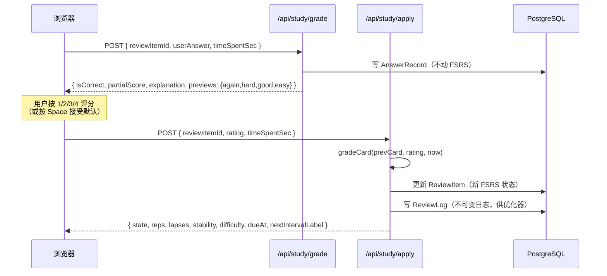
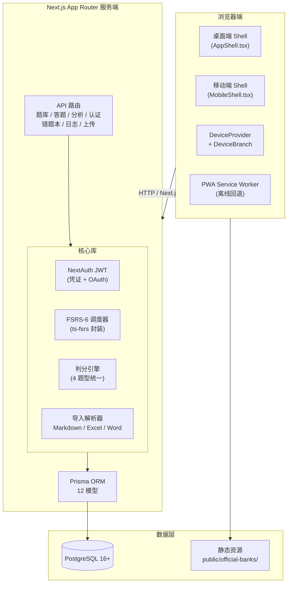
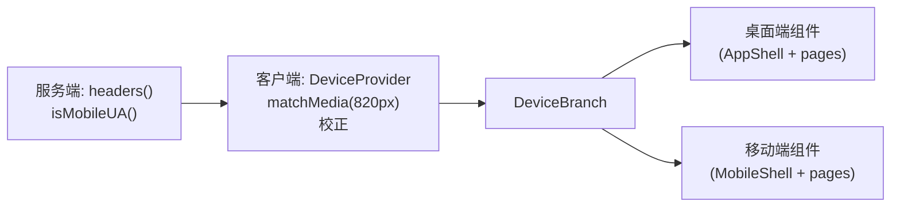

<p align="center">
  
</p>

<h1 align="center">Compass · 刷题罗盘</h1>

[English](README.md) | [中文](README.zh.md) | [日本語](README.ja.md)

<p align="center">
  自托管的间隔重复刷题工具，基于 FSRS-6 算法，界面采用航海仪器风格。<br/>
  导入 Markdown / Excel / Word 题库 → 在键盘驱动的答题舱里做题 → 由算法决定每张卡下次什么时候回来。
</p>

<p align="center">
  <a href="LICENSE"></a>
  <a href="#"></a>
  <a href="https://gitcode.com/badhope/compass/releases"></a>
  
  
  
  
  
  
  
  
  
</p>

<p align="center">
  <a href="#这是什么">这是什么</a> ·
  <a href="#学习指南">学习指南</a> ·
  <a href="#核心功能">核心功能</a> ·
  <a href="#设备自适应移动端适配">移动端</a> ·
  <a href="#快速开始">快速开始</a> ·
  <a href="#部署">部署</a> ·
  <a href="#架构总览">架构</a> ·
  <a href="#测试">测试</a> ·
  <a href="#路线图">路线图</a>
</p>

---

## 这是什么

刷题罗盘（Compass）是一款自托管、开源刷题工具，是商业刷题应用的替代品。它解决两个问题：

1. **不受供应商锁定。** 题库属于你。支持 Markdown（读起来像笔记）、Excel（直接粘贴）和 Word（拖拽上传）导入。随时可以导出。使用 PostgreSQL 数据库，schema 完全开源——`pg_dump` 即可带走。

2. **不用自己计算复习间隔。** Anki 的 SM-2 算法是 1985 年的；间隔重复技术向前发展了。Compass 使用 [ts-fsrs](https://github.com/open-spaced-repetition/ts-fsrs) 实现 **FSRS-6**（DSR 模型，21 个默认权重）。它将"回忆准确度"与"卡片返回时间"分离——按 1-4 评分即可，算法负责调度。

航海主题命名——刷题罗盘（指引方向）、错题漂流瓶（错题本）、航海日志（答题记录）、航行计划（学习计划）——自然映射到应用功能。

> **仓库**：<https://gitcode.com/badhope/compass>

---

## 学习指南

### 5 步上手刷题罗盘

1. **注册账号**——访问 `/register`，创建账号。（也可以使用演示账号：`captain@compass.dev` / `Compass-Test-2026!`）
2. **导入题库**——前往 `/workshop`（造船工坊），打开"官方题库"，选择一个（FSRS、地理、TypeScript、Python 任选）并点击"加载"。或者拖拽 `.md` / `.xlsx` / `.docx` 文件到页面。
3. **开始学习**——点击刷题罗盘首页（`/compass`）的"开始"按钮。算法将到期的卡片拉入你的队列。
4. **答题与评分**——输入答案，按 `Enter` 提交。然后用 4 键评分条（或键盘 1-4）评分：
   - `1` **Again** —— 完全遗忘，卡片重置
   - `2` **Hard** —— 勉强回忆，短间隔
   - `3` **Good**（默认）—— 正常回忆，正常间隔
   - `4` **Easy** —— 流畅回忆，长间隔
5. **回顾与分析**——查看错题漂流瓶（`/wrongbook`）中积累的错题，或在航迹分析（`/analytics`）中查看记忆健康度、连续天数、热力图和 FSRS 状态分布。

> 💡 应用会根据您的设备**自动切换桌面和移动端布局**。在移动端使用底部导航栏和滑动操作。

---

## 核心功能

| 模块 | 路径 | 功能 |
|---|---|---|
| **刷题罗盘**（首页） | `/compass` | 今日待复习数、连续天数、题库舰队、一键开始 |
| **答题舱** | `/study` | 4 种题型、4 键 FSRS 评分（热键 1-4）、间隔预览、部分给分、断点续答、完成报告 |
| **造船工坊** | `/workshop` | 题库 CRUD、拖拽导入（`.md/.txt/.xlsx/.csv/.docx`）、官方题库按需加载、每库 FSRS 配置 |
| **题库详情** | `/workshop/[id]` | 题目内联编辑、CSV/Anki 导出、FSRS 调优（留存率/新题数/复习上限） |
| **错题漂流瓶** | `/wrongbook` | 答错次数 > 0 的卡片；可回顾、标记已掌握或重新作答 |
| **航海日志** | `/logbook` | 所有答题记录倒序时间线，可按题库筛选 |
| **航迹分析** | `/analytics` | 连续天数、正确率、FSRS 状态分布、365 天热力图、记忆健康度（可检索性环形图 + 5 桶分布 + 7 天预测）、薄弱知识点 TOP 10 |
| **账户中心** | `/account` | 个人资料、双主题切换（深海/羊皮纸）、FSRS 参数预览、语言切换 |

### 4 种题型及判分规则

| 题型 | 答案形状 | 判分 |
|---|---|---|
| `SINGLE_CHOICE` | `"B"` | 正确 = 1.0，否则 0 |
| `MULTI_CHOICE` | `["A","C"]` | 全对 = 1.0；漏选 = `0.5 + (选中正确数/应选正确数) * 0.5`，上限 0.99；错选 = 0 |
| `TRUE_FALSE` | `true` / `false` | 正确 = 1.0，否则 0 |
| `FILL_BLANK` | `["北京"]` | 每空单独处理：trim + 转小写 + 全角转半角 + 折叠空白；`|` 分隔可接受答案 |

---

## 设备自适应移动端适配

Compass 采用 **DeviceBranch**（设备分支）模式——相同 URL 为桌面端和移动端渲染**完全独立的组件树**，而非 CSS 响应式缩放。

```
服务端 UA 检测 → isMobileUA()
         ↓
浏览器 matchMedia (820px) 校正
         ↓
    DeviceProvider (React 上下文)
         ↓
    DeviceBranch({mobile, desktop})
```

- **桌面端**：`AppShell`——左侧导航栏、宽屏布局、键盘导向交互。
- **移动端**：`MobileShell`——底部 4 标签导航 + FAB、触控优化卡片布局、滑动前进、`safe-area-inset` 支持。

全部 12 个应用路由（`login`, `register`, `compass`, `study`, `workshop`, `wrongbook`, `logbook`, `analytics`, `account`, `forgot-password`, `reset-password`, `bank-detail`）都有独立的移动端页面。

---

## 两阶段提交

为避免重复调度 FSRS（用户覆盖默认评分时），答题流拆分为两个 API 调用：



`grade` 阶段会根据 `partialScore` 自动映射默认评分（全对 → GOOD，部分对 → HARD，全错 → AGAIN）。按 `Space` 接受默认，或按 `1/2/3/4` 覆盖。

---

## 快速开始

### 前置依赖

| 工具 | 最低版本 | 备注 |
|---|---|---|
| Node.js | 22.13 | pnpm 11 需要 |
| pnpm | 11 | 通过 `package.json` 的 `packageManager` 锁定；corepack 自动安装 |
| PostgreSQL | 16+ | 17 也可以用 |

### 本地开发

```bash
git clone https://gitcode.com/badhope/compass.git
cd compass
pnpm install
cp .env.example .env
# 编辑 .env——至少设置：
#   DATABASE_URL      postgresql://postgres:<密码>@localhost:5432/compass?schema=public
#   NEXTAUTH_SECRET   openssl rand -base64 32

pnpm db:generate
pnpm db:migrate
pnpm db:seed          # 创建演示用户 + FSRS 参数（不包含题库）
pnpm dev              # → http://localhost:3000
```

种子创建演示账号：`captain@compass.dev` / `Compass-Test-2026!`。生产环境中请修改或删除。

### 导入官方题库

```bash
pnpm exec tsx scripts/import-official-banks.mjs
```

此脚本以演示用户身份登录，将所有 4 个官方题库（FSRS 入门、中国地理、TypeScript、Python）导入你的工坊——共 80 题，可直接学习。

---

## 部署

### Docker（自托管，推荐）

仓库附带现成的 `Dockerfile` + `docker-compose.yml`：

```bash
cp .env.example .env
# 编辑 .env——设置 DATABASE_URL 使用 'db' 服务（见下方说明）
docker compose up -d --build
docker compose run --rm app pnpm prisma migrate deploy
docker compose exec app node scripts/import-official-banks.mjs
```

> 在 `docker-compose.yml` 中，应用通过内部 Docker 网络连接到 `db` 服务：\
> `DATABASE_URL=postgresql://compass:change-me@db:5432/compass?schema=public`

附带 `Caddyfile` 示例，可用于生产环境的反向代理 + 自动 TLS（Let's Encrypt）。

### 云平台

详见 [DEPLOYMENT.md](DEPLOYMENT.md) 了解三种部署方式的详细步骤：

| 方式 | 适合场景 | 数据库 |
|---|---|---|
| **Vercel + Neon** | 快速启动，Serverless | Neon（Serverless Postgres） |
| **Railway / Render** | 一站式托管含数据库 | 内置 Postgres |
| **自托管 VPS + Docker** | 完全控制，隐私优先 | 自己的 PostgreSQL |

> ⚠️ **已知限制**：`POST /api/upload` 端点将媒体文件（题干中的图片/音频）写入 `public/uploads/` 目录。在 Serverless 平台（Vercel）上该存储是临时性的——冷启动后上传的文件会丢失。如需完整的上传支持，请使用 Docker 配合持久卷，或将上传处理器替换为 S3/R2 存储。

---

## 题库导入

### 官方题库（内置）

Compass 内置 4 个官方题库，以 Markdown 静态文件存放于 `public/official-banks/`。可在工坊页面（"官方题库"对话框）或通过上述导入脚本加载——未加载前不占用数据库。

| 题库 | 题数 | 覆盖范围 |
|---|---|---|
| FSRS 与间隔重复 | 20 | DSR 模型、评分机制、权重调优 |
| 中国地理与文化 | 20 | 省份、河流、文化遗产、民俗 |
| 编程基础与 TypeScript | 20 | 类型系统、泛型、异步、模块 |
| Python 编程 | 20 | 数据类型、面向对象、异常、标准库 |

### Markdown 格式（推荐）

```markdown
# 题库名（可选，第一行）

---

## 单选题

题干可以跨多行。

A. 选项 A
B. 选项 B
C. 选项 C
D. 选项 D

答案：B
解析：因为 B 是正确的。
难度：3
知识点：代数基础
来源：2024 考试

---

## 多选题

下列哪些是正确的？

A. 选项 A
B. 选项 B

答案：AC
```

填空题支持多空（`||` 分隔）和可接受答案（`|` 分隔）：

```
答案：北京|Beijing||长江|Yangtze River
```

### Excel / CSV / Word

详见已有导入文档——所有格式均支持中文列别名、自动推断题型和管道符分隔选项。

---

## 配置

所有环境变量在 `.env.example` 中有文档说明。必填项：

| 变量 | 用途 |
|---|---|
| `DATABASE_URL` | PostgreSQL 连接串（Prisma 格式） |
| `NEXTAUTH_URL` | 部署 URL（生产环境必须为 `https://`） |
| `NEXTAUTH_SECRET` | JWT 签名密钥——`openssl rand -base64 32` |
| `NEXT_PUBLIC_SITE_URL` | 用于 SEO metadataBase / canonical / sitemap 的公开 URL |

可选：SMTP（密码重置邮件）、OAuth 提供商（GitHub/Google 第三方登录）、OpenAI（AI 智能出题）。

---

## 架构总览



### 设备检测流程



### 数据模型

| 模型 | 用途 |
|---|---|
| `User` | 账号、主题、语言、FSRS 权重 |
| `QuestionBank` | 题库，含每库 FSRS 配置（每日新题数、留存率） |
| `Question` | 题干、选项（JSON）、答案（JSON）、解析、知识点 |
| `ReviewItem` | 用户 × 题目的 FSRS 卡片状态（稳定性、难度、到期时间） |
| `ReviewLog` | 不可变复习日志，供 FSRS 优化器使用 |
| `AnswerRecord` | 每次答题尝试，含部分得分和用时 |
| `QuizSession` / `SessionAnswer` | 会话分组（可选） |
| `FsrsParams` | 用户 FSRS 权重 |
| `AgentGenerationTask` | AI 智能体任务队列 |

### API 端点

| 端点 | 方法 | 用途 |
|---|---|---|
| `/api/auth/[...nextauth]` | * | NextAuth：登录、会话、JWT |
| `/api/auth/register` | POST | 邮箱注册 |
| `/api/auth/forgot-password` | POST | 发送重置密码邮件 |
| `/api/auth/reset-password` | POST | 重置密码 |
| `/api/banks` | GET/POST | 列出/创建题库 |
| `/api/banks/:id` | GET/PATCH/DELETE | 题库 CRUD |
| `/api/banks/:id/questions` | GET/POST | 题目列表/创建 |
| `/api/banks/import` | POST | 多文件导入（MD/XLSX/DOCX） |
| `/api/banks/:id/export` | GET | CSV/Anki 导出 |
| `/api/questions/:id` | GET/PATCH/DELETE | 题目 CRUD |
| `/api/study/queue` | GET | 构建每日队列 |
| `/api/study/grade` | POST | 判分（阶段一） |
| `/api/study/apply` | POST | 应用 FSRS 评分（阶段二） |
| `/api/wrongbook` | GET/PATCH | 错题列表/标记已掌握 |
| `/api/logbook` | GET | 所有答题记录 |
| `/api/analytics` | GET | 聚合统计和 FSRS 状态 |
| `/api/upload` | POST | 媒体上传（图片/音频） |
| `/api/health` | GET | 容器健康探针 |
| `/robots.txt` | GET | SEO robots（环境变量驱动） |
| `/sitemap.xml` | GET | SEO sitemap（环境变量驱动） |

---

## 测试

Compass 维护三层测试：

### 1. 单元测试（无需数据库，CI 必跑）

```bash
pnpm test:unit
```

49 个纯逻辑测试，覆盖判分（13）、FSRS 状态映射（19）和解析器（17）。使用 `node:assert`，零测试框架依赖。

### 2. API 烟雾测试（需要开发服务器 + 数据库）

```bash
pnpm test:api
```

7 个测试组，覆盖未认证拦截、登录、题库 CRUD、两阶段提交、错题本、日志、分析。

### 3. E2E 测试（Playwright，需要开发服务器 + 数据库）

```bash
pnpm exec playwright test
```

14 个移动端 E2E 测试（`tests/e2e/`）：

| 文件 | 用例数 | 覆盖范围 |
|---|---|---|
| `mobile-auth.spec.ts` | 3 | 登录、注册、忘记密码（移动端 Shell） |
| `mobile-navigation.spec.ts` | 7 | 所有移动端页面渲染、导航持久化、登出 |
| `mobile-study.spec.ts` | 2 | 答题 + 评分循环、空状态 |

移动端测试串行执行（共享登录会话）以避免限流。桌面端 E2E 套件覆盖站点走查、导入流程和答题。

---

## 技术栈

| 层 | 选型 | 版本 |
|---|---|---|
| 框架 | Next.js (App Router) | 16.2 |
| 语言 | TypeScript | 5.9 |
| 样式 | Tailwind CSS | 4.3 |
| ORM | Prisma | 5.22 |
| 数据库 | PostgreSQL | 16+ |
| 认证 | NextAuth.js (JWT) | 4.24 |
| 间隔重复 | ts-fsrs | 5.4 |
| UI 原语 | Radix UI | 1.1 |
| Excel 解析 | xlsx | 0.18 |
| Word 解析 | mammoth | 1.12 |
| 动画 | framer-motion | 12.42 |
| 图标 | Lucide React | 1.25 |
| 校验 | Zod | 4.4 |
| 测试 | Playwright | 1.61 |

---

## 设计系统

航海/天文色调——黄铜环、深渊底色、象牙文字、珊瑚警示。

**核心色板**

| Token | Hex | 用途 |
|---|---|---|
| `abyss` | `#0b1426` | 背景深度 |
| `ivory` | `#f5f1e8` | 主要文字 |
| `brass` | `#c9a227` | 交互高亮 |
| `tide` | `#4a7c82` | 次要、信息 |
| `coral` | `#d97757` | 破坏性操作 |

**反馈色板**（4 键评分）

| Token | Hex | 评分 |
|---|---|---|
| `f-emerald` | `#10b981` | Easy — 流畅回忆 |
| `f-azure` | `#38bdf8` | Good — 正常回忆 |
| `f-amber` | `#f59e0b` | Hard — 勉强答对 |
| `f-coral2` | `#ef4444` | Again — 完全遗忘 |

两套主题：**深海**（深渊 + 黄铜 + 星空，默认）和**羊皮纸**（暖米色 + 深棕文字）。字体使用系统原生字体；无 CDN 依赖。

---

## 命令速查

| 命令 | 用途 |
|---|---|
| `pnpm dev` | 开发服务器（端口 3000） |
| `pnpm build` | 生产构建（standalone 输出） |
| `pnpm start` | 启动生产服务器 |
| `pnpm lint` | ESLint |
| `pnpm typecheck` | TypeScript 类型检查（`tsc --noEmit`） |
| `pnpm test:unit` | 单元测试（判分 + FSRS + 解析器，无需数据库） |
| `pnpm test:api` | API 烟雾测试（需要开发服务器 + 数据库） |
| `pnpm exec playwright test` | Playwright E2E 测试 |
| `pnpm db:generate` | 生成 Prisma 客户端 |
| `pnpm db:migrate` | 应用迁移（开发） |
| `pnpm db:deploy` | 部署迁移（生产） |
| `pnpm db:seed` | 插入演示用户 + FSRS 参数 |
| `pnpm db:studio` | 启动 Prisma Studio GUI |
| `node scripts/import-official-banks.mjs` | 导入所有官方题库 |

---

## 路线图

### V1 — 刷题基础（已完成）
- [x] FSRS-6 调度 + 4 键评分
- [x] 4 种题型统一判分
- [x] Markdown / Excel / Word 导入
- [x] 错题漂流瓶 + 航海日志 + 航迹分析
- [x] 深海 / 羊皮纸 双主题

### V1.1–V1.4 — 打磨与加固（已完成）
- [x] 欢迎引导、题库舰队卡片、完成报告升级
- [x] 记忆健康度（可检索性）+ 断点续答 + 365 天热力图
- [x] 题目内联编辑 + 每库 FSRS 调优 + CSV/Anki 导出
- [x] 官方题库按需加载 + seed 精简化
- [x] Docker 一键部署 + CI + 49 个单元测试

### V1.5 — 移动端适配与落地页（已完成）
- [x] **设备感知渲染**：12 个路由使用独立移动端组件树，DeviceBranch 模式
- [x] **移动端 Shell**：底部 4 标签导航、FAB、触控优化布局、safe-area 适配
- [x] **移动端答题**：答题 + 滑动 + 评分条，完整答题流程
- [x] **移动端认证**：登录/注册/忘记密码/重置密码使用移动端 Shell
- [x] **落地页丰富**：工作原理、定价方案、FAQ 手风琴、隐私/自托管说明
- [x] **14 个移动端 E2E 测试**（Playwright，串行执行）
- [x] 4 个官方题库（80 题完整导入）
- [x] SEO：环境变量驱动的 metadataBase、sitemap、robots.txt

### V2 — AI 智能体
- [ ] 上传资料 → 自动生成题目
- [ ] 知识点自动打标
- [ ] 根据答题数据校准难度
- [ ] 个人 FSRS 权重优化器

### V3 — 多平台
- [ ] 微信小程序（共享 API + 设计 token）
- [ ] 公开题库分享（只读链接）
- [ ] Monero / Stripe 订阅（定价 UI 已就位）

---

## 贡献

欢迎提交 Issue 和 PR，请前往 [gitcode.com/badhope/compass](https://gitcode.com/badhope/compass)。详见 [CONTRIBUTING.md](CONTRIBUTING.md) 了解代码风格、提交规范和答题逻辑路由规则。

行为规范见 [CODE_OF_CONDUCT.md](CODE_OF_CONDUCT.md)，安全问题见 [SECURITY.md](SECURITY.md) 中的非公开披露流程。

---

## License

MIT — 详见 [LICENSE](LICENSE)。
